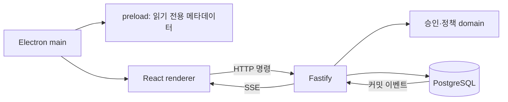

# 저장소 구조와 경계

## Orca에서 참고한 구조

확인: 2026-09-18, [stablyai/orca](https://github.com/stablyai/orca/tree/0d23ea6e688410c878096dab8b1779857354b7d4), commit `0d23ea6e688410c878096dab8b1779857354b7d4`.

Orca는 Electron 코드를 `src/main`, `src/preload`, `src/renderer/src`, `src/shared`, `src/types`로 분리하고 root electron-vite 설정, pnpm lockfile, config/scripts, tests, docs를 사용한다. 이 파일·책임 구성을 Roopre에 적용했다. Orca의 구현 코드·브랜딩·배포 자격 증명을 복사하거나 Orca 포크로 만들지는 않았다.

현재 없는 모바일·네이티브 모듈·CLI·클라우드 서비스 폴더를 빈 패키지로 만들지 않는다. M2 runner가 구현될 때 독립 실행 경계를 추가한다. 단일 루트 패키지와 pnpm-workspace 설정으로 필요한 빌드 스크립트만 허용한다.

## 실행 구조

renderer에는 Node·파일·셸 실행 권한이 없다. preload는 현재 앱 이름만 제공한다. API는 별도 프로세스로 실행하며 renderer에서 권한 있는 Electron main 모듈을 import하지 않는다. domain과 shared는 UI 프레임워크에 의존하지 않는다.

## 데이터 계약

M1은 workspace JSONB 상태와 events/commands 테이블을 사용한다. 같은 workspace의 쓰기는 행 잠금으로 직렬화하고 상태·이벤트·응답을 원자적으로 기록한다. DB와 fixture 범위는 이전 구현 그대로 유지한다. 모든 인가 검사는 현재 fixture 사용자 기준이며 실제 인증은 아니다.

설계 본문과 수용 기준의 SHA-256은 버전에 고정된다. 실행 예약 시 승인·차단 의견·정책 버전을 검사한다. 실제 runner dispatch 직전 재검사는 M2 구현 항목이다. 자연어 지침을 저장한 것만으로 코드 품질이 보장된다고 간주하지 않는다.

프로젝트 정책 변경이 공통 정책 버전을 올리는 방식과 JSONB 단일 잠금은 M1의 제한이다. 많은 프로젝트의 팀 운영 전에 프로젝트별 정책 영향 계산과 테이블/잠금 분리를 검토한다.

## 기존 폴더에서의 이전

| 이전                     | 현재                                       |
| ------------------------ | ------------------------------------------ |
| apps/desktop/main.cjs    | src/main/index.ts                          |
| apps/desktop/renderer    | src/renderer/src                           |
| packages/contracts       | src/shared/contracts.ts                    |
| apps/server              | src/server                                 |
| packages/domain          | src/domain                                 |
| packages/database        | src/database                               |
| scripts                  | config/scripts                             |
| npm + 단일 renderer Vite | pnpm + electron-vite main/preload/renderer |

기존 `/Users/roopre/Documents/WORK/ai-development-process`는 조사와 최초 구현의 보존본이다. 앞으로 개발의 기준은 이 Git 저장소다. 승인된 PRODUCT-DESIGN v0.1은 원문 바이트를 유지했으며 구조 변경은 이번 사용자의 “이 레포에 개발하고 Orca처럼 레포 구성” 요청에 따른다.
