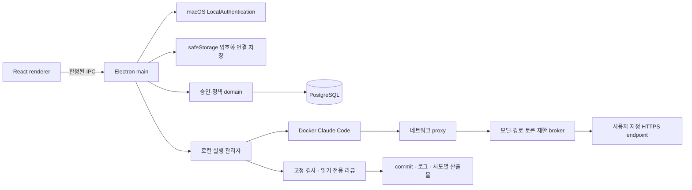

# 저장소 구조와 경계

## Orca에서 참고한 구조

확인: 2026-09-18, [stablyai/orca](https://github.com/stablyai/orca/tree/0d23ea6e688410c878096dab8b1779857354b7d4), commit `0d23ea6e688410c878096dab8b1779857354b7d4`.

Orca는 Electron 코드를 `src/main`, `src/preload`, `src/renderer/src`, `src/shared`, `src/types`로 분리하고 root electron-vite 설정, pnpm lockfile, config/scripts, tests, docs를 사용한다. 이 파일·책임 구성을 Roopre에 적용했다. Orca의 구현 코드·브랜딩·배포 자격 증명을 복사하거나 Orca 포크로 만들지는 않았다.

단일 루트 패키지에서 renderer, IPC, domain, 저장소, Docker runner의 책임을 나눈다. 모델에 완료 판단을 전부 맡기지 않고 프로그램이 승인·고정 검사·상태 전이를 검사한다.

## 실행 구조

renderer는 Node·파일·셸에 직접 접근하지 않는다. preload에 명시한 메서드만 호출한다. owner 데이터에는 HTTP API가 없으며 Electron main에서만 본인 인증 증명을 발급한다. M1 fixture API는 별도 workspace로 보존하며 실제 실행기를 연결하지 않는다.

현재 실행 관리자는 Electron main 안에 있고 CLI·테스트는 별도 Docker 프로세스다. 독립 상주 daemon/원격 runner는 아직 없다. 정상 앱 종료는 작업을 중단하고 컨테이너 종료를 기다린다. 강제 종료 후 재시작은 이전 컨테이너를 먼저 정리하며 종료 확인이 불가능하면 차단한다. Mac sleep 중 가용성은 보장하지 않는다.

## 승인과 상태

설계 본문·완료 기준 hash, 팀 정책 버전, 해당 프로젝트 지침·필수 검사·owner·실행 프로필·의존 관계를 승인 binding에 묶는다. 본인 인증 대기 중 계약이 변경되어도 이전 증명으로 승인할 수 없다. owner는 자신이 작성한 설계도 직접 승인할 수 있고 AI에게 승인 권한은 없다.

PostgreSQL workspace JSONB 행 잠금으로 명령과 실행 claim을 직렬화한다. 시작·단계 전환·완료 때 승인을 검사하고, 실행 중 주기적으로 취소·승인 철회·연결 변경을 확인한다. 프로젝트 정책 변경은 해당 프로젝트 승인만 무효화한다. 실제 여러 사용자의 인증·DB 권한 경계는 M3다.

## 격리와 검증 근거

독립 Git clone을 사용해 원본 저장소와 `.git` 쓰기 경계를 분리한다. agent 안의 `.git`은 읽기 전용이며 호스트 home, Docker socket, API key를 마운트하지 않는다. 구현/검사/리뷰 사이 컨테이너를 교체해 이전 background 작업을 제거한다. 리뷰에서는 체크아웃 전체가 읽기 전용이다.

agent 네트워크는 internal Docker network다. sidecar는 호스트 broker만 전달하며 broker는 실행별 토큰·모델·Messages 경로를 제한한다. 실제 key는 호스트에서 HTTPS 요청에만 붙인다. broker는 Docker 접속을 위해 임시 포트에서 listen하므로 실행 토큰 보호가 필요하다. 호스트 OS와 Docker 관리자는 신뢰 경계 안에 있다.

의존성 준비는 승인한 이미지 ID와 잠금 파일을 사용하며 설치 스크립트를 비활성화한다. 기존 테스트/설정/manifest hash를 보호하고 고정 argv 검사를 실행한다. 검사 전후 Git tree와 리뷰 후 tree가 일치해야 완료한다. AC별 AI 검토 근거도 요구하지만 그 정확성을 수학적으로 보장하지는 않는다.

각 시도의 검사 로그와 제한된 이미지/trace/report 산출물을 보존하고 파일 hash 확인 후 Finder에서 찾는다. HTML을 앱 권한으로 실행하지 않는다. 실패/중단 복구는 같은 승인 binding의 변경만 새로운 체크아웃에 적용한다. 대량 diff는 자동 검토/복구를 중단한다.

병합·배포·의존 기능 자동 통합, 역할별 모델 연결, 보관 기간 자동 정리, 장기 무진행 watchdog, 팀 인증·원격 runner는 후속 작업이다. 현재 의존 기능이 등록된 실행은 통합 확인을 요구하며 자동 진행하지 않는다.

## 기존 폴더에서의 이전

| 이전                     | 현재                                       |
| ------------------------ | ------------------------------------------ |
| apps/desktop/main.cjs    | src/main/index.ts                          |
| apps/desktop/renderer    | src/renderer/src                           |
| packages/contracts       | src/shared/contracts.ts                    |
| apps/server              | src/server                                 |
| packages/domain          | src/domain                                 |
| packages/database        | src/database                               |
| scripts                  | config/scripts                             |
| npm + 단일 renderer Vite | pnpm + electron-vite main/preload/renderer |

기존 `/Users/roopre/Documents/WORK/ai-development-process`는 조사와 최초 구현의 보존본이다. 앞으로 개발의 기준은 이 Git 저장소다. 승인된 PRODUCT-DESIGN v0.1은 원문 바이트를 유지했으며 구조 변경은 이번 사용자의 “이 레포에 개발하고 Orca처럼 레포 구성” 요청에 따른다.
