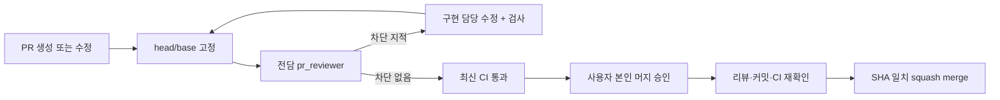

# PR 리뷰와 본인 승인 후 머지

> 이번 v0.3 PR은 후속 사용자 지시로 전담 리뷰·검사 후 main 반영을 승인받았다. [최신 승인 기록](design/V03-APPROVAL.md)을 적용한다. 아래는 일반 절차이며 제품의 본인 설계 승인과 기존 CLI 인증 규칙은 유지한다.

사용자 요청: “리뷰전담에이전트 만들어서 걔가 리뷰하도록 프로세스”, “승인받아서 머지”. 이 요청은 프로세스 구축 승인이지 현재 PR의 머지 승인이 아니다. 구현 전 설계 본인 승인도 그대로 유지한다.



## 역할과 자동 실행 범위

- 구현 담당: 코드·테스트 수정, CI 확인, PR 생성/갱신.
- 리뷰 전담: [역할 정의](../agents/pr-reviewer.md)에 따라 별도 에이전트가 고정된 변경을 검토한다. 구현 담당의 자기 리뷰로 대체하지 않는다.
- 진행 담당: 입력 생성, 전담 에이전트 호출, 보고서 게시, 수정/재리뷰 반복, 사용자에게 결과 전달.
- 사용자: 최종 변경과 리뷰를 보고 머지 여부를 결정한다. AI는 대신 승인하지 않는다.

이 저장소에서 작업하는 코딩 에이전트는 AGENTS.md에 따라 PR 생성/수정 후 전담 리뷰를 호출한다. 역할 파일만으로 GitHub 웹훅/24시간 클라우드 에이전트가 실행되는 것은 아니다. 별도 API key나 유료 Actions 모델 연결을 임의로 추가하지 않는다.

## 명령

```bash
pnpm pr:prepare 1
# 진행 담당이 새 pr_reviewer를 호출해 위 입력과 agents/pr-reviewer.md를 전달한다.
# reviewer가 만든 실제 JSON 경로를 아래 <report.json> 자리에 넣는다.
pnpm pr:publish <report.json>
pnpm pr:check <report.json>
# 차단 지적 수정 → 새 커밋 push → prepare/전담 재리뷰/publish/check 반복
pnpm pr:merge <report.json>
```

`prepare`는 정확한 Git 객체와 diff를 준비한다. `publish`는 사람이 읽을 결과를 PR 댓글로 남기고 해당 head에 `roopre/pr-review` 상태를 기록한다. GitHub APPROVE는 만들지 않는다. 게시 영수증과 원격 댓글 내용이 일치해야 `check/merge`를 진행한다.

`check`는 열린 main 대상 PR, report의 PR/head/base 일치, 차단 지적 없음, CI의 `check` 존재, 모든 검사 성공, 병합 가능 상태를 확인한다. 검사 누락·실패·대기·skip은 통과가 아니다. 현재 draft 여부는 승인 검사를 막지 않으며 실제 머지 직전에만 ready로 바꾼다.

`merge`는 먼저 같은 검사를 수행하고, 이어 **macOS 본인 인증 창에서 PR 번호·커밋을 표시해 사용자 머지 승인을 받는다.** 이 창의 승인이 실제 머지 승인이다. 취소/인증 실패는 머지하지 않는다. 승인 후 head/base와 CI·원격 보고서를 다시 확인하고 `--match-head-commit`으로 해당 head만 squash merge한다. 자동 머지 예약, admin 우회, 브랜치 강제 push나 삭제는 사용하지 않는다. 정상 머지 확인 후 로컬 영수증을 남긴다.

먼저 PR의 리뷰와 미검증 범위를 사용자에게 보여준다. 리뷰 에이전트와 CI는 merge 명령을 호출하지 않는다. 승인 전에는 머지를 실행하거나 승인 영수증을 합성하지 않는다. 이 명령은 macOS/Xcode Command Line Tools와 `gh` 인증을 전제로 한다.

## 강제 범위와 한계

2026-09-18 실제 GitHub API 확인 결과, 이 비공개 저장소의 branch protection은 현재 요금제에서 HTTP 403(Upgrade to GitHub Pro or make this repository public)을 반환했다. 저장소 공개 전환/요금제 변경은 하지 않았다.

따라서 지금 적용한 것은 코딩 에이전트의 저장소 절차와 전용 머지 명령의 검사다. **GitHub 웹이나 다른 API 클라이언트의 직접 머지를 서버에서 차단하지는 못한다.** 팀 단위 강제가 필요하면 지원 요금제에서 CI·전담 리뷰를 required checks로 지정하고 main 직접 push/admin 우회를 제한한다. 같은 GitHub 사용자 토큰으로 게시되는 AI 상태를 별도 사람 승인이라고 주장하지 않는다.

머지 API는 head 변경을 원자적으로 거절한다. base는 승인 전후 재검사하지만 현재 서버 보호 없이 base 동시 변경을 완전히 잠그지는 못한다. 보고서 파일/로컬 저장소/OS 관리자와 연결된 GitHub 계정은 신뢰 경계 안이다. CI 결과나 AI 의견만으로 사람의 본인 인증을 대체하지 않는다.

[GitHub CLI의 head 일치 머지](https://cli.github.com/manual/gh_pr_merge), [GitHub 브랜치 보호](https://docs.github.com/en/repositories/configuring-branches-and-merges-in-your-repository/managing-protected-branches/about-protected-branches)를 기준으로 설계했다.
