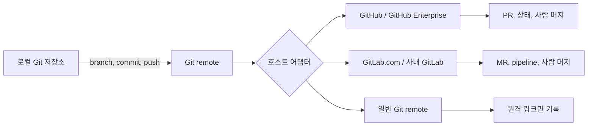
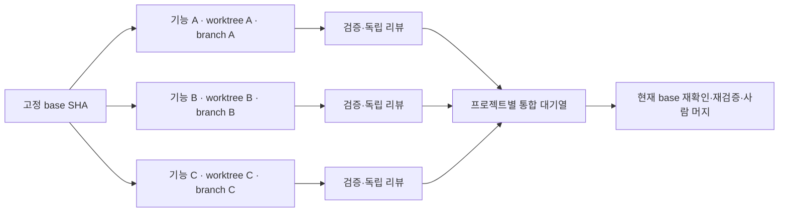

# Git 호스트 연동 설계 초안

상태: **구현 승인됨**. 승인 근거와 고정 해시는 [승인 기록](GIT-HOST-INTEGRATION-APPROVAL.md)에 둔다. 실제 회사 Git host·토큰 호출은 사용자가 이 앱에서 연결을 추가하고 명시적으로 검사할 때만 발생한다.

## 목표

Roopre가 로컬 Git 저장소로 기능을 실행하는 방식은 유지하면서, 결과를 GitHub, GitHub Enterprise, GitLab.com, 사내 GitLab에 일관되게 전달한다. 사용자는 프로젝트마다 연결된 호스트의 merge request 또는 pull request, pipeline 상태, Roopre 독립 리뷰 보고서를 한 화면에서 확인한다.

호스트에 의존하지 않는 Git 작업과 호스트 API 작업을 분리한다.

## 지원 범위

### M1: 실제 제공

| 호스트                   | 범위                                                                                                                                 |
| ------------------------ | ------------------------------------------------------------------------------------------------------------------------------------ |
| GitHub.com               | remote 감지, 연결 시험, branch push, draft PR 생성, PR 상태·댓글·commit status 읽기/게시, SHA 고정 머지 검증                         |
| GitHub Enterprise Server | GitHub와 같은 계약. 사용자가 API base URL을 등록하며 임의 TLS 우회는 허용하지 않음                                                   |
| GitLab.com               | remote 감지, 연결 시험, branch push, draft MR 생성, MR/pipeline 상태·note 읽기/게시, SHA 고정 머지 검증                              |
| 사내 GitLab              | GitLab.com과 같은 API v4 계약. HTTPS와 운영체제 신뢰 CA만 허용                                                                       |
| 기타 Git remote          | Git branch, commit, push와 Roopre 실행은 지원. 외부 PR/MR API·상태 게시·자동 머지는 제공하지 않고 remote URL과 수동 리뷰 링크만 기록 |

Bitbucket, Azure DevOps, Gitea, Gerrit은 이번 구현에서 API 어댑터를 추가하지 않는다. 다만 공통 계약과 remote parser를 재사용해 별도 어댑터로 추가할 수 있게 한다. "모든 Git 호스트의 API를 이미 지원한다"고 표시하지 않는다.

### 제외 범위

- 토큰을 runner 컨테이너나 renderer에 노출하는 구조
- 임의 host, HTTP, 인증서 검증 해제 연결
- Roopre가 사람 승인·protected branch·CODEOWNERS를 우회하는 merge
- Git hosting vendor의 CI 설정 자동 변경
- 웹훅 서버, SSO, 조직 전역 앱 설치와 중앙 token 운영

## 데이터와 보안 경계

프로젝트의 `executionProfile`에는 비밀이 아닌 Git remote, provider kind, API base URL, repository slug, base branch, 상태 확인 정책만 저장한다. 토큰은 기존 macOS safeStorage 방식의 별도 `GitHostVault`에 `connectionId`로만 연결한다. API key, PAT, OAuth refresh token은 workspace DB, export, runner harness, 로그, renderer IPC 응답에 포함하지 않는다.

`GitHostConnection`은 다음을 가진다.

- `kind`: `github` 또는 `gitlab`
- `baseUrl`: GitHub Enterprise 또는 사내 GitLab의 HTTPS URL. public SaaS는 고정 기본값
- `token`: OS 암호화 저장소에만 저장
- `scopes`: 연결 시험에서 확인한 최소 권한 결과
- `version`, `testedAt`, `testStatus`, 안전하게 축약한 진단

remote parser는 HTTPS와 SSH URL의 host/namespace/repository를 정규화한다. 감지 결과가 여러 연결과 일치하거나 host를 알 수 없으면 자동 선택하지 않고 사용자가 연결을 고른다. 원격 URL에 사용자명·토큰이 포함되어 있으면 설정 저장을 거부한다.

GitHub는 fine-grained token의 Contents, Pull requests, Commit statuses read/write 권한을 안내한다. GitLab은 프로젝트 또는 개인 access token의 최소 `api` 권한을 안내하되, 실제 instance 정책과 권한 검사를 연결 시험 결과로 표시한다. 토큰 값은 UI에 다시 표시하지 않는다.

## 상태 전이와 사용자 흐름

1. 사용자가 저장소를 선택한다. Roopre는 `origin` remote와 현재 base commit만 읽고 호스트 API를 호출하지 않는다.
2. GitHub/GitLab remote가 감지되면 설정 화면에서 "호스트 연결"을 제안한다. 사용자는 연결을 고르고 명시적으로 연결 시험을 실행한다.
3. 실행은 기존 worktree·commit·검증 흐름을 그대로 사용한다. 실행 성공이 곧 push나 PR/MR 생성은 아니다.
4. 결과 검토 화면에서 사용자가 **원격 브랜치 게시**를 선택하면, 현재 head와 base가 다시 검증된 뒤 feature branch만 push한다.
5. 사용자가 **Draft PR/MR 생성**을 선택하면 어댑터는 생성 결과의 URL·번호·head SHA·base SHA를 저장한다. 제목·본문은 사용자 검토 가능한 초안이다.
6. 독립 리뷰 보고서는 같은 SHA에 댓글/note로 게시한다. GitHub commit status 또는 GitLab commit status는 host 설정이 허용될 때만 게시한다. 권한 또는 인스턴스 기능이 부족하면 게시 실패를 숨기지 않고, 보고서 링크만 로컬에 남긴다.
7. host pipeline·PR/MR 상태가 head SHA와 일치하고 필수 정책이 통과했을 때만 "사람 머지 승인 대기"로 보인다. 최종 merge는 사용자 본인 인증 후 GitHub/GitLab API에 SHA를 함께 전달한다. base 또는 head 변경, draft 상태, pending/failed pipeline, merge conflict, 보고서 불일치는 모두 중단한다.

프로젝트 안의 설계 승인과 host PR/MR 승인은 별개다. Roopre의 설계 승인 없이 실행할 수 없고, 호스트의 required approval과 branch protection을 Roopre가 대신 만족시킨다고 주장하지 않는다.

## 병렬 실행과 worktree 소유권

모든 쓰기 실행은 원본 저장소가 아닌 feature·run·attempt에 고정된 별도 Git worktree에서만 수행한다. 호스트 종류와 무관한 이 계약이 동시성 안전의 기준이다.

- Run을 만들 때 현재 base branch의 commit SHA를 고정한다. 이후 base branch가 움직여도 기존 run의 worktree·설계·검증 근거를 조용히 새 base로 바꾸지 않는다.
- worktree 경로와 branch는 `project / feature / run / attempt` 정체성으로 유일하게 만든다. 같은 feature의 재시도도 새 attempt worktree를 사용하며, 이전 attempt는 읽기 전용 근거로 남긴다.
- 한 worktree에는 한 쓰기 실행만 허용한다. 에이전트와 사람이 동시에 수정하려면 기존 실행을 중단하고 종료를 확인한 뒤 명시적으로 소유권을 넘긴다.
- 원격 branch도 run별로 유일하다. push는 로컬 `HEAD`, 기록한 원격 branch SHA, 고정 base SHA를 모두 확인한다. 다른 사용자가 같은 원격 branch를 변경했거나 branch가 예상과 다르면 push하지 않고 `remote_branch_diverged`로 중단한다.
- 기본 push는 fast-forward만 허용한다. force push는 사용하지 않는다. 손상된 branch를 재작성하는 대신 새 attempt branch를 만들고 새 PR/MR을 생성한다.
- 같은 기능의 active run은 하나만, 서로 다른 기능은 병렬 실행할 수 있다. 공통 migration·lockfile·release 설정처럼 충돌 가능 자원은 프로젝트 설정의 직렬화 키를 통해 동시에 실행하지 않는다.
- PR/MR은 하나의 source branch와 고정 head SHA에만 연결한다. 새 commit이 생기면 기존 독립 리뷰·검사·host pipeline 결과는 stale로 표시하고 재검토한다.
- merge는 프로젝트와 target base branch별 직렬 대기열에서만 시도한다. 각 후보는 merge 직전에 target base SHA와 PR/MR head SHA를 다시 읽고, base가 바뀌면 최신 base에서 새 worktree 검증을 거친 뒤에만 사람 승인 대기로 돌아간다.

이 규칙으로 GitHub PR, GitLab MR, 일반 Git remote 모두 동일하게 "병렬 구현은 가능하지만 통합은 직렬·재검증"을 적용한다. 호스트의 merge queue나 branch protection이 있으면 Roopre의 대기열과 함께 관찰하되, Roopre가 이를 우회하지 않는다.

## 어댑터 계약

공통 `GitHostAdapter`는 다음 작업만 노출한다.

- `detect(remoteUrl)`
- `testConnection(connection)`
- `getRepository(remote)`
- `pushBranch(localPath, branch, expectedHead)`
- `createDraftChange(input)`
- `snapshotChange(ref)`
- `publishReview(report, expectedHead)`
- `assertMergeReady(ref, expectedHead, policy)`
- `merge(ref, expectedHead, method)`

공통 snapshot에는 `state`, `headSha`, `baseSha`, `draft`, `mergeability`, `pipeline/checks`, `url`만 담는다. GitHub의 PR number와 GitLab의 MR IID 같은 provider 내부 ID는 adapter 내부에서만 사용한다. 상태 확인은 provider의 현재 head SHA와 Roopre가 고정한 head SHA가 같을 때만 신뢰한다.

GitHub REST와 GitLab REST API v4를 직접 사용한다. `gh`나 `glab` 설치 여부에 동작이 달라지지 않게 한다. 사내 GitLab의 API path는 `<baseUrl>/api/v4`로 고정하고, enterprise reverse proxy를 위한 경로 변형은 명시 설정으로만 허용한다.

## UI

프로젝트 설정의 실행 환경 아래에 **Git 호스트** 섹션을 둔다.

- 감지한 remote와 provider 후보
- 연결 상태, 마지막 연결 시험, 권한 부족 이유
- base branch, remote branch, 현재 head/base SHA
- Draft PR/MR 생성과 외부 페이지 열기
- pipeline/check 목록과 마지막 동기화 시각
- 원격 리뷰 보고서 링크와 게시 상태

기능 결과 화면에는 "원격 전달" 행을 추가한다. 아직 host 연결이 없으면 일반 Git 결과와 수동 링크만 보여 주며, GitHub UI를 GitLab에 그대로 노출하지 않는다.

## 검증

- remote URL parser: GitHub.com, GHES, GitLab.com, 사내 GitLab, SSH/HTTPS, subgroup, token 포함 URL 거부
- Vault: token 비노출·연결 version·삭제·연결 시험 오류 redaction
- GitHub/GitLab fixture API: SHA mismatch, draft, pending/failed pipeline, conflict, 권한 부족, 댓글/status 게시 실패
- push: 예상 head와 local/remote head 불일치, protected branch 거부, 중복 요청 idempotency
- 병렬: 동일 base에서 기능 세 개가 서로 다른 worktree·branch·port namespace를 쓰는지, 같은 feature의 이중 쓰기·같은 worktree 재사용·원격 branch 외부 변경을 거절하는지
- 통합: 두 PR/MR이 같은 target branch를 기준으로 완료돼도 첫 merge 뒤 두 번째 후보의 base·검사·독립 리뷰를 stale 처리하고 새 worktree 재검증을 요구하는지
- merge: 사용자 본인 인증 전후 snapshot 재확인, SHA/base 변경 시 API 호출 없음
- UI: provider별 용어, 연결 실패, generic remote fallback, 다크/라이트·1024px·키보드·axe
- 실제 disposable GitLab 프로젝트와 GitHub test repository는 사용자가 승인한 전용 token과 프로젝트가 준비된 뒤 별도 E2E로 검증한다. 이 설계 단계에서는 실제 회사 GitLab·token·PR/MR을 호출하지 않는다.

## 수용 기준

1. 로컬 Git 실행은 provider 연결이 없어도 기존처럼 동작한다.
2. GitHub.com/GHES/GitLab.com/사내 GitLab URL을 정확히 구분하고 subgroup GitLab 경로를 보존한다.
3. renderer, export, logs, runner 입력에서 Git token을 찾을 수 없다.
4. draft PR/MR의 head/base SHA, URL, provider ID를 저장하고 화면에 표시한다.
5. 리뷰 보고서와 status/pipeline 관찰은 SHA가 일치할 때만 전달 완료로 표시한다.
6. 사람 승인 전에는 merge API를 호출하지 않고, 승인 뒤에도 head/base/pipeline을 다시 검사한다.
7. 어댑터 미구현 host는 일반 Git mode로 명확히 표시하고 API 지원을 가장하지 않는다.
8. 기존 GitHub 전용 저장소 유지보수 CLI는 새 adapter로 옮겨 GitLab에서도 같은 report schema·정확한 SHA·독립 리뷰 게이트를 쓸 수 있다.
9. 병렬 기능은 서로 다른 worktree·branch·run namespace에서만 쓰기를 수행하며, 같은 feature·worktree·원격 branch의 동시 쓰기는 거절한다.
10. merge는 project/base branch별 직렬 대기열에서만 수행하고, 앞선 merge로 base가 바뀐 후보는 새 worktree 검증과 재리뷰 없이는 merge할 수 없다.

## 구현 순서

1. 공유 host 계약·remote parser·비밀 vault와 pure unit fixture를 만든다.
2. 프로젝트 설정/상태 UI와 GitHub/GitLab read-only snapshot을 연결한다.
3. 명시적 push·draft PR/MR 생성·review report 게시을 추가한다.
4. SHA 고정 merge gate와 macOS 본인 인증을 provider별로 연결한다.
5. `pr-workflow`를 공통 CLI로 이관하고 GitHub/GitLab fixture 및 실제 전용 sandbox E2E를 추가한다.

## 근거

- GitLab은 GitLab.com, Self-Managed, Dedicated에서 MR API와 MR 생성 방식을 제공한다: <https://docs.gitlab.com/user/project/merge_requests/creating_merge_requests/>.
- GitLab MR approval API와 external status check는 현재 MR head SHA를 명시적으로 요구할 수 있다: <https://docs.gitlab.com/api/merge_request_approvals/>, <https://docs.gitlab.com/api/status_checks/>.
- GitLab access token은 REST API 인증에 `PRIVATE-TOKEN` header를 사용한다: <https://docs.gitlab.com/user/profile/personal_access_tokens/>.
