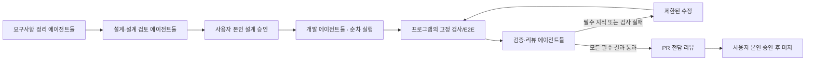

# 루프리 v0.3 · 설치와 커스텀 에이전트 설계

> 최신 상태: 2026-09-18 [v0.3 구현 승인](V03-APPROVAL.md)을 받고 구현했습니다. 아래 제안 당시 상태는 설계 이력이며, 실제 구현·검증 범위와 남은 조건은 [검증 기록](../VERIFICATION.md)을 따릅니다.

**상태: 검토용 제안, 사용자 본인 설계 승인 전.** 사용자의 요청은 ① 테스트 데이터 없는 다운로드형 앱 ② 단계별 복수 에이전트 ③ Markdown 지침 ④ 전역/프로젝트 분리다. 샘플 데이터 제거는 별도 유지보수로 진행한다. 아래 신규 설치·다중 에이전트 실행 계약은 승인 후 구현한다. 설계 승인, 구현 완료, PR 머지 승인, 공개 배포 승인은 서로 다르다.

## 1. 요구사항

| 구분                | 이번에 만들 동작                                                                     |
| ------------------- | ------------------------------------------------------------------------------------ |
| 첫 실행             | 가상 사람/프로젝트/기능/완료 기록 없이 시작. 내 프로젝트 생성으로 안내               |
| 설치                | 소스·Node·pnpm·수동 DB 명령 없이 앱에서 환경 준비. Git/Docker가 없으면 설치 안내     |
| 에이전트 라이브러리 | 여러 정의 생성·복제·수정·보관, 전역 또는 특정 프로젝트에 공개                        |
| 단계별 구성         | 요구사항·설계·개발·검증·리뷰 단계마다 여러 에이전트 배치, 순서와 필수 여부 설정      |
| Markdown            | 붙여넣기·편집·미리보기·파일 가져오기/내보내기. API key는 Markdown에 넣지 않음        |
| 지침                | 전역 → 프로젝트 → 단계 → 에이전트 → 기능 지침의 적용 내용·출처·버전을 확인           |
| 품질                | 고정 검사와 필수 에이전트 결과를 모두 확인. AI가 본인 승인·검사 실패를 덮어쓰지 못함 |
| 진행 화면           | 프로젝트/기능/단계/개별 에이전트의 상태, 산출물, 실패 원인, 재시도와 비용 표시       |

설치 상세는 [외부 베타 설치 설계](EXTERNAL-BETA-DESIGN.md)를 포함한다. Apple Silicon macOS 로컬 소유자 베타가 첫 대상이다. 실제 다중 사용자 서버/SSO는 기존 후속 범위이며 이번에 연결됐다고 표시하지 않는다. 저장 DB를 갑자기 다른 엔진으로 교체하지 않고, 기존 PostgreSQL을 사용자별 Docker 환경으로 준비한다.

## 2. 화면과 사용 흐름

사이드바는 **프로젝트 · 실행 현황 · 에이전트 · 지침 · 연결/환경**으로 정리한다.

- 첫 실행: 환경 상태 → 환경 준비 → AI 연결 → 내 프로젝트 만들기 → 개발 흐름 선택. 가상의 프로젝트를 자동 생성하지 않는다.
- 에이전트: 목록에서 이름/공유 범위/권한/연결/버전을 확인한다. 편집 화면은 이름·역할·모델 연결·Markdown 편집/미리보기와 유효 지침 보기로 구성한다.
- 프로젝트의 개발 흐름: 단계별 카드에 에이전트를 추가하고 위/아래 이동으로 순서를 바꾼다. 필수/선택 상태와 코드 수정 권한을 눈에 보이게 표시한다.
- 지침: 전역과 프로젝트 탭을 분리한다. 원문과 실제 합성될 지침을 나란히 확인하고 변경 영향(재승인이 필요한 기능)을 보여준다.
- 실행 상세: 단계 아래 개별 에이전트 행을 표시한다. 로그 외에 입력 버전·지침 출처·출력 문서·검사 결과·지적을 열 수 있다. 실패한 행에 재시도/수정 필요 이유를 표시한다.

처음에는 라이브러리를 비워 두고 “기본 개발 흐름으로 시작” 또는 “직접 구성”을 고른다. 기본 흐름은 실제 실행 가능한 설정을 생성하는 선택형 템플릿이며 샘플 작업·가짜 완료 결과를 넣지 않는다. 예시 템플릿은 요구사항 정리, 설계 검토, 구현, 컨벤션 검증, 보안 검토, 테스트 결과 검토다.

## 3. 실행과 승인



- 요구사항/설계 에이전트는 저장소를 읽고 문서 초안을 반환한다. main이 검증 후 새 초안으로 저장하며 기존 사용자 편집을 덮어쓰지 않는다. 소스 파일 수정과 자동 설계 승인은 금지한다.
- 개발 단계에만 코드 쓰기 권한을 허용한다. 같은 기능의 개발 에이전트는 순차 실행하여 동일 체크아웃 동시 수정을 피한다. 각 결과와 바뀐 Git tree를 기록한다.
- 테스트 명령은 승인된 실행 프로필로 프로그램이 수행한다. 검증/리뷰 에이전트는 파일·diff·테스트 산출물을 읽고 구조화된 지적을 반환한다. “컨벤션 검증” 에이전트가 pass여도 ESLint/타입/필수 테스트 실패는 실패다.
- 첫 버전은 단계 내부 에이전트도 순차 실행한다. 여러 프로젝트/기능은 현재 전체 2개·프로젝트당 1개 제한과 종료 미확인 점유 규칙을 유지한다. 구성할 수 있는 에이전트 수와 동시에 실행하는 수는 다르다.
- 필수 검증자 중 하나라도 실패·잘못된 JSON·시간 초과이면 완료하지 않는다. 선택 검증자는 경고와 미실행 사실을 표시한다. 개발 작업의 필수 구현자와 최소 한 명의 필수 리뷰어는 제거할 수 없다.
- 수정 반복은 현재 프로젝트의 제한 횟수·전체 시간 한도 안에서 수행한다. 코드가 바뀌면 고정 검사와 필수 리뷰를 새 tree에 대해 전부 다시 수행한다. 이전 pass를 재사용하지 않는다.
- 모델/연결/에이전트 지침/단계 배치 변경은 승인된 실행 계약에 포함한다. 사용 중인 정의가 바뀌면 영향받는 기능의 승인 무효화·새 실행 차단·진행 실행 중단을 적용한다. 쓰이지 않는 정의의 수정은 다른 프로젝트를 무효화하지 않는다.

## 4. 정의·버전·Markdown 형식

에이전트 정의와 실행 인스턴스를 분리한다.

- `AgentDefinition`: id, revision, name, description, scope(global/project), projectId, capability(read-only/implementation), connectionId 또는 프로젝트 연결 상속, instructionMarkdown, archivedAt.
- `WorkflowRevision`: 프로젝트별 버전, 단계별 assignment 목록(agentId/revision/order/required), 단계 지침, 수정/시간 한도.
- `AgentExecution`: runId, stage, assignmentId, agent revision, model/connection version, input tree/hash, effectiveInstruction hash, 상태, 시도, 시작/종료, 출력/지적, 추정 비용.
- `ResolvedHarness`: 실제 참조한 전역/프로젝트/단계/에이전트 지침 원문과 버전, 연결 버전, 단계 순서, 권한, 필수 기준. 사람이 승인한 설계와 함께 hash로 고정한다.

일반 Markdown을 그대로 입력할 수 있다. 아래 frontmatter는 가져오기/내보내기 시 선택적으로 지원하는 **루프리 형식**이며 Claude Code 형식과 완전 호환을 주장하지 않는다.

```markdown
---
schema: roopre-agent/v1
name: convention-reviewer
description: 프로젝트 컨벤션과 변경 코드를 대조한다.
capability: read-only
---

# 역할

승인된 설계, 전역 지침, 프로젝트 지침과 실제 diff를 대조한다.

# 검토 기준

- 프로젝트의 명명 규칙과 오류 처리 방식을 확인한다.
- 형식·타입 규칙은 고정 lint/typecheck 결과와 함께 판단한다.
- 지적마다 파일·행·영향·수정 방향을 제시한다.
- 근거가 부족하면 통과로 단정하지 않는다.
```

scope·연결은 가져오기 화면에서 명시적으로 선택한다. 파일에 API key, 임의 endpoint 인증 정보, shell hooks, 자동 설치 명령, 임의 MCP 권한을 넣어 실행시키지 않는다. 미지원 frontmatter는 가져오기 전에 알려주고, 잘못된 형식·중복 키·과도한 크기·심볼릭 링크/FIFO는 거절한다. 가져온 문서는 사용자가 저장/게시하기 전 실행에 반영하지 않는다.

## 5. 지침 합성·권한·품질

합성된 지침은 전역, 프로젝트, 해당 단계, 해당 에이전트, 승인된 기능 순으로 출처 제목과 함께 표시한다. 원문을 보존하고 모호한 의미 충돌을 자동 해결했다고 주장하지 않는다. 구체적인 프로젝트 관례는 하위 지침으로 보완할 수 있지만, 프로그램의 승인·권한·고정 검사·비용/시간 한도는 Markdown으로 해제할 수 없다.

사용자/저장소의 CLAUDE.md가 CLI에서 암묵적으로 추가 로딩되어 표시된 계약과 달라지지 않도록 실행 adapter가 적용 파일과 설정을 제어한다. 첫 구현은 루프리가 전달한 고정 지침만 사용하고, 저장소 지침을 쓰려면 명시적으로 가져와 승인된 snapshot에 포함한다. 임의 로컬 hooks/settings/credentials를 컨테이너에 복사하지 않는다.

각 역할은 별도 Claude Code 실행 세션으로 호출한다. Claude의 자동 위임 판단에 필수 단계 실행 여부를 맡기지 않고 루프리 실행기가 순서와 다음 단계 허용 여부를 관리한다. 초기 provider는 기존 Anthropic Messages 호환 연결이며 OpenAI 호환 API를 이름만 바꿔 지원한다고 표시하지 않는다.

에이전트별 다른 연결/모델을 선택할 수 있다. key는 main vault에 보관하고 해당 호출에 필요한 broker만 연다. 단계 간 연결·세션을 재사용하지 않으며 전체 실행 예산과 시간 한도를 공유한다. 임의 endpoint의 실제 청구액 절대 상한은 보장할 수 없으므로 현재 추정 비용의 한계를 그대로 표시한다.

## 6. 저장·호환·복구

기존 사용자 프로젝트/설계/실행을 자동 삭제하지 않는다. 새 데이터 형식은 schema version으로 구분하고 기존 기록은 기존 실행 계약으로 읽는다. 새 커스텀 흐름을 적용하면 현재 설계를 재게시·본인 재승인한 뒤 새 실행에서만 사용한다. 정의 삭제는 보관 처리하며 과거 실행이 참조한 revision은 유지한다.

초안 저장에는 revision 비교를 사용한다. 동시에 저장하거나 파일을 다시 가져올 때 변경 내용을 비교하고 사용자 작성 내용을 조용히 덮어쓰지 않는다. 실행 중단 시 어느 에이전트까지 수행됐는지 저장하되, 코드가 달라진 뒤 기존 검사 pass로 건너뛰지 않는다. 환경 준비·기존 DB 이전의 실패/복구는 별도 설치 설계의 원본 보존 조건을 따른다.

## 7. 인수 기준

- AC01: 새 앱/새 워크스페이스의 프로젝트·기능·실행은 0개이며 가상 검토자가 없다. 기존 실제 데이터를 초기화하지 않는다.
- AC02: Node/pnpm/소스 없이 앱 시작과 환경 준비가 가능하고 무작위 DB 자격 증명/loopback을 사용한다. 재시작·취소·중복 클릭·실패 복구를 검증한다.
- AC03: 전역/프로젝트 에이전트를 여러 개 만들고 Markdown 붙여넣기/파일 왕복/편집/복제/보관이 가능하다.
- AC04: 프로젝트마다 다른 단계 구성으로 실행하며 한 단계의 복수 에이전트 각각에 상태·입력 버전·결과가 남는다.
- AC05: 컨벤션 검사와 보안 리뷰를 필수로 배치했을 때 한 명의 실패/누락으로 완료가 차단된다. 선택 지적은 분명히 표시한다.
- AC06: 전역/프로젝트/단계/에이전트 지침의 출처·적용 원문을 볼 수 있다. 관련 변경 후 이전 승인으로 실행할 수 없다.
- AC07: 설계 승인 전 소스 수정이 없고, 검토자가 본인을 승인하거나 필수 검사를 무력화할 수 없다.
- AC08: 다른 연결/모델을 사용하는 두 에이전트의 credential이 섞이지 않는다. 로그·Markdown 내보내기·renderer에 key가 없다.
- AC09: 여러 프로젝트의 실행·중단·실패·재시작, 종료 미확인 점유, stale 결과 거절을 검증한다.
- AC10: 서명·공증된 패키지의 별도 Mac 설치와 실제 유료 provider의 작은 기능 end-to-end 실행을 검증한 뒤 배포 가능으로 표시한다. fixture와 실제 통합 결과를 구분한다.

구현 순서는 **빈 시작/테스트 분리 → 앱 환경 준비 → 정의/지침/흐름 편집 → 승인 binding과 runner → 결과 UI → 실제 통합/배포 검증**이다. 미완성 UI만 먼저 보여주고 실행 연결 완료로 표시하지 않는다.

## 8. 공식 사례와의 관계·승인 요청

Claude Code는 Markdown frontmatter로 역할·도구·모델 등을 정의하고 사용자/프로젝트 범위로 관리한다. 루프리는 이 접근을 참고하지만 자기 실행 계약과 별도 화면을 제공한다. [Claude 커스텀 에이전트](https://code.claude.com/docs/en/sub-agents), [지침 범위](https://code.claude.com/docs/en/memory).

OpenAI의 공개 harness 사례는 저장소 지식·검증·도구 환경을 에이전트가 활용할 수 있게 만드는 접근을 설명한다. 루프리에 적용할 원칙은 **문서로 방향을 주고, 프로그램으로 필수 검증·승인·실행 상태를 관리하는 것**이다. 모든 AI 회사의 단일 표준이라고 주장하지 않는다. [OpenAI harness engineering](https://openai.com/index/harness-engineering/).

검토할 결정은 다음 세 가지다.

1. 소수 개발자용 macOS 베타, 앱이 PostgreSQL/Docker 환경을 준비하는 설치 흐름.
2. 전역/프로젝트 에이전트 라이브러리와 단계별 복수 배치. 첫 버전은 단계 내부 순차 실행.
3. 본인 설계 승인과 고정 검사는 해제할 수 없고, 지침·모델·배치 변경 시 영향받는 계약 재승인.

Apple Developer 가입/인증서와 실제 API 연결은 여전히 별도 준비가 필요하다. 비밀값은 채팅 대신 Keychain/앱 연결 화면에 넣는다. 이 문서가 승인돼도 PR 머지나 공개 게시를 자동 승인한 것으로 취급하지 않는다.
