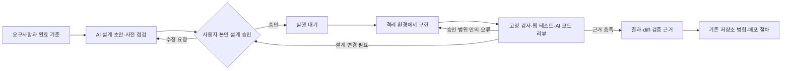

# 루프리 v0.2 — 본인 설계 승인과 실제 개발 실행

2026-09-18 · **사용자 검토 대기 / 구현 미승인**

이 문서는 실제 기업 사례 비교, 현재 앱 직접 사용 결과, 다음 구현 설계를 합친 검토 문서다. [v0.1](PRODUCT-DESIGN.md)의 불변 원본과 [M1 승인 기록](DESIGN-REVIEW.md)은 유지한다. 기존 승인은 M1에 한정되며, 아래 M2 확장에 재사용하지 않는다.

## 1. 먼저 결정할 내용

추천은 **Electron 맥 앱 + 상태를 관리하는 API/PostgreSQL + 별도 실행기**다. Claude Code는 실행 도구로 연결하고, 승인·재시도·완료 판정은 루프리 프로그램이 관리한다. 일반 워크플로우 도구는 CI·알림 연결에 활용한다. 처음부터 시각적 워크플로우 편집기나 자체 코딩 모델을 만들지 않는다.

핵심 흐름은 다음과 같다.



사람의 주된 개입은 **코드를 작성하기 전 설계 승인**이다. 이후 세부 구현·실패 수정·자동 검증은 승인된 범위에서 진행한다. 다만 설계 승인이 구현의 정확성을 증명하지는 않으므로 자동 코드 리뷰와 테스트는 남긴다. 사람의 별도 코드 리뷰는 저장소 정책에 따라 유지하며, 이 도구가 기존 보호 규칙을 해제하지 않는다.

**승인 요청 범위:** 아래 요구와 계약에 따른 M2-A → B → C 구현. M3 팀 배포는 방향만 제시하며 실제 조직 연결·운영 배포는 별도 설계를 검토한다. 사용자 답변 전에는 현재 앱의 동작·승인 규칙을 바꾸지 않는다.

## 2. 요구사항: 확정·제안·미정

| ID  | 구분 | 내용                                     | 완료 증거                                             |
| --- | ---- | ---------------------------------------- | ----------------------------------------------------- |
| R01 | 확정 | 사용자가 설계를 직접 보고 승인한 뒤 구현 | 실제 본인 승인 기록과 미승인 실행 거절                |
| R02 | 확정 | API key와 endpoint를 앱에서 입력         | 연결 생성·검사·변경·삭제 시나리오                     |
| R03 | 확정 | 여러 프로젝트·여러 기능 동시 개발        | 프로젝트 2개/기능 2개 실행과 격리 증거                |
| R04 | 확정 | 전역·프로젝트·단계·역할·기능별 지침      | 실행에 적용된 버전·출처·유효 지침 조회                |
| R05 | 확정 | 진행 상황과 중간 결과를 즉시 확인        | 단계·대기 이유·diff·검사 결과의 실제 이벤트           |
| R06 | 확정 | 웹 시나리오 자동화와 실패 수정           | 승인된 AC별 자동 검사·trace·재검증                    |
| R07 | 확정 | 루프리로 루프리를 개발하며 개선          | 실제 run과 후보 커밋·검사·개선 이력 연결              |
| R08 | 확정 | 실무에 쓸 수 있는 품질                   | 아래 출시 관문 통과; 문서/샘플만으로 완료 금지        |
| R09 | 제안 | Claude Code 어댑터부터 실제 연결         | 로컬 설치 버전/테스트 gateway/실제 endpoint 각각 검증 |
| R10 | 제안 | 설계 승인과 병합·배포 권한 분리          | 승인만으로 main push/운영 배포 불가                   |
| R11 | 제안 | 장시간 작업에 한도·중단·복구 적용        | 예산/시간 초과·재시작·취소·중복 실행 검사             |
| R12 | 미정 | 실제 gateway 주소·인증 규격·모델·예산    | 구현 후 앱에서 입력; 채팅에 key 요청하지 않음         |
| R13 | 미정 | 팀 IdP, 팀 서버 위치, Apple 서명 계정    | M3 시작 전 구체 구성 결정                             |

‘동일한 퀄리티’는 동일한 결과를 보장한다는 뜻으로 사용하지 않는다. 모든 작업에 같은 최소 기준을 적용하고, 통과 근거와 실패율을 비교할 수 있게 하는 것이 제품이 보장할 범위다.

## 3. 실제 회사 방식과 얼마나 비슷한가

조사 확인일은 2026-09-18이다. 아래는 공개된 **특정 팀의 운영 사례 또는 실험**이며 모든 회사의 전사 개발 규칙으로 일반화하지 않는다. 공식 글의 성과 수치는 자체 보고이고 루프리의 기대 성과가 아니다.

| 사례·공개 시점                                                                                                                | 확인한 방식                                                                                    | 루프리에 적용할 점                                            | 주의할 해석                                                              |
| ----------------------------------------------------------------------------------------------------------------------------- | ---------------------------------------------------------------------------------------------- | ------------------------------------------------------------- | ------------------------------------------------------------------------ |
| [OpenAI harness engineering](https://openai.com/index/harness-engineering/) · 2026-02-11                                      | 내부 제품 실험에서 사람이 목표·환경을 설계하고 에이전트가 구현·리뷰; 작업별 앱·관측 환경 제공  | 저장소 문서, worktree별 실행, 브라우저·로그 접근, 자동 리뷰   | 모든 OpenAI 팀의 정책도, 모든 작업의 사람 설계 승인 사례도 아님          |
| [Anthropic 장기 실행 harness](https://www.anthropic.com/engineering/effective-harnesses-for-long-running-agents) · 2025-11-26 | 초기 환경 설정, 기능 목록, 진행 기록, 세션 간 인계, 브라우저 검증 실험                         | 구조화한 AC·진행 기록과 실제 E2E 증거                         | 데모 중심 연구이며 무제한 자율 개발의 보장은 아님                        |
| [Anthropic planner/generator/evaluator](https://www.anthropic.com/engineering/harness-design-long-running-apps) · 2026-03-24  | 구현과 평가를 분리하고 실행 결과로 반복; 모델 개선 후 불필요한 중간 단계를 줄임                | 생성자와 별도 평가 관점, 실제 사용 평가; 비용을 측정하며 반복 | 에이전트 수/반복 횟수를 늘릴수록 항상 좋다는 결과가 아님                 |
| [Spotify Honk](https://engineering.atspotify.com/2025/11/spotifys-background-coding-agent-part-1) · 2025-11-06                | 기존 Fleet Management·PR/검토 흐름 안에 에이전트 CLI를 넣고 검사·trace·교체 가능한 모델을 통합 | 기존 저장소·CI 활용, 어댑터 경계, 팀 표준을 기본 제공         | 유지보수·마이그레이션 중심 성과를 신규 제품 전체에 그대로 적용할 수 없음 |
| [Ramp Inspect](https://engineering.ramp.com/post/why-we-built-our-background-agent) · 2026-01-12                              | 세션별 VM에 개발 환경·도구를 제공하고 테스트·시각 검증·미리보기를 연결                         | 실행 환경을 먼저 준비하고 결과를 직접 볼 수 있게 함           | 큰 클라우드 인프라를 개인용 맥 파일럿부터 복제할 필요는 없음             |
| [Uber software factory](https://www.uber.com/us/en/blog/efficient-software-factory/) · 2026-08-27                             | 관리형 에이전트, 실제 업무 벤치마크, 결과당 비용·품질 측정으로 모델 선택                       | 성공한 작업당 비용, 재작업·회귀·사람 개입을 함께 측정         | 토큰 가격이나 생성 코드량만으로 도입 효과를 판단하지 않음                |

**판단:** 루프리의 ‘표준 흐름 + 관리형 실행 + 검증 근거’ 방향은 이 사례들과 맞는다. 현재 구현은 설계·승인 관리 부분에 머물러 있어 같은 운영 수준이라고 말할 수 없다. 특히 **본인이 구현 전에 설계 승인**하는 것은 이 제품에 맞춘 명시적 정책이며, 조사된 회사들이 모두 강제하는 공통 규칙은 아니다.

Stripe Minions 원문도 확인했으나 이번 웹 추출에서는 본문이 비어 있었다. 상세 구조는 이 문서의 판단 근거에 포함하지 않았다. 이전 광범위 조사는 [기존 조사 보고서](../research/RESEARCH-2026-09-17.md)에 보존한다.

## 4. 직접 사용한 현재 앱

대상 코드: `8a5a97e6fda86d321adb1879bcda2846eeba9120`. 실제 API/PostgreSQL에 연결한 동일 React renderer를 브라우저에서 조작했다. 이 기록은 Electron 네이티브 권한·Keychain·Dock 검증을 의미하지 않는다.

| 직접 수행/확인                                            | 관찰                                                                      | 필요한 개선                              |
| --------------------------------------------------------- | ------------------------------------------------------------------------- | ---------------------------------------- |
| 지침·팀 설정 열기                                         | 전역·단계·역할·프로젝트 지침은 있으나 provider 설정 없음                  | 연결 설정과 역할별 연결 선택             |
| ‘Roopre · 자체 개발’ 프로젝트 생성                        | 이름·설명만 입력, 실제 저장소 경로 연결 없음                              | 폴더 선택·remote/base branch·실행 프로필 |
| ‘M2 · 본인 설계 승인과 API 연결 기반 자체 개발’ 기능 생성 | 요구사항 입력·저장은 가능                                                 | 이를 실제 run으로 이어주는 실행기        |
| 설계 화면 확인                                            | 작성자 준, 검토자 민아·소라는 fixture; 본인 인증 아님                     | 실제 소유자 승인으로 교체                |
| 미승인 기능의 실행·결과 열기                              | 실행 등록 비활성, 실행기 미연결을 명시                                    | 사용자 승인 후 실제 실행·검증 연결       |
| `/health` 읽기                                            | `development-fixture`, `runnerConnected:false`                            | 실제 runner 연결/생존/능력 상태          |
| 설치된 CLI 기능 확인                                      | Claude Code `2.1.126`; print/stream-json/bare/max-budget/resume 지원 표시 | 버전별 계약 검사; 실제 호출은 아직 안 함 |

이번 자체 사용은 **요구사항·설계 관리까지의 dogfood**다. 이 기능의 샘플 계정 승인이나 실행을 만들지 않았다. API key를 읽거나 기존 개인 Claude 로그인으로 유료 호출하지 않았다. 루프리가 스스로 코드를 작성했다고 보고하지 않는다.

직접 사용에서 우선 해결해야 할 제품 문제는 ‘다음 행동의 단절’이다. 프로젝트를 만들었으면 저장소 연결, 설계를 승인했으면 실행 준비, 실행이 막혔으면 원인과 해결 버튼이 이어져야 한다. 작업 수만 늘어나는 보드로는 실무 흐름을 완성할 수 없다.

## 5. 승인 계약 — 본인이 승인한다

### 역할과 의미

- **프로젝트 소유자:** 이번 사용자는 본인. 설계 승인·철회, 중요 설계 변경 승인 권한을 가진다.
- **설계 작성자:** 사람 또는 AI. 작성자라는 이유로 소유자의 승인 권한을 없애지 않는다. 기존 ‘작성자는 절대 승인 불가’ 규칙을 소유자 정책과 분리한다.
- **기술 검토자:** 추가 의견을 남기는 선택 역할. 팀 정책으로 필수화할 수 있으나 소유자 승인을 대체하지 않는다.
- **에이전트/runner:** 초안 작성·결과 제출 가능. 사용자 승인·검토자 변경·검사 완화 권한 없음.

### 승인 대상

승인은 `featureId + designVersion + designHash + requirementsHash + effectivePolicyHash + repositoryId + baseCommit + executionProfileVersion`을 대상으로 기록한다. `approverId`, 인증 방식, 시각, 결정, 이유, 일회성 challenge ID를 함께 저장한다. 실행 profile에는 허용 도구·검사·예산·환경 권한이 포함된다. key 자체는 포함하지 않는다.

서버는 승인 요청과 실행 lease 발급 시 모두 현재 값을 대조한다. 예전 버전의 승인, 재사용 challenge, 철회한 승인, 다른 기능의 승인은 거부한다. ‘승인하고 실행’ 버튼은 두 동작을 명시한 경우에만 사용한다. 기본 버튼은 ‘설계 승인’, 이후 준비된 작업을 사용자가 실행 요청한다.

요구사항·API 계약·DB 구조·보안/권한·필수 검사·예산 상향·데이터 전송 목적지 변경은 재승인 대상이다. 함수명·내부 파일 배치·동일 계약의 버그 수정은 승인 범위 안이다. 기준 브랜치가 이동하면 새 기준으로 재검증하며 초기 M2는 기준 commit 변경에 재승인을 요구한다. 향후 자동 재승인 생략은 별도 정책으로 검토한다.

실행 중 승인이 철회되거나 무효가 되면 새 작업을 할당하지 않고 현재 프로세스를 중지한다. 종료 확인 전 다른 runner가 같은 작업을 이어받지 않는다. 변경 파일·로그는 복구 근거로 남긴다.

### 실제 사람임을 확인하는 단계

M2 로컬 파일럿은 Electron main의 승인 전용 경로에서 OS 사용자 확인을 거쳐 일회성 승인 증명을 만든다. 지원 기기에서는 Touch ID를 사용하고, 대체 OS 인증은 해당 macOS에서 실제 검증한 뒤 제공한다. 인증 기능이 없는 경우 **개발용 사용자 전환으로 우회하지 않고 승인 불가**로 표시한다. renderer가 임의 사용자 ID만 보내 승인하는 API는 없앤다.

로컬 OS 확인은 그 기기의 신뢰 경계이며 조직 신원을 증명하지는 않는다. 팀 운영 M3는 OIDC의 실제 사용자·프로젝트 소유권·재인증과 서버 권한 검사로 승인한다. 자동화 runner에는 승인용 토큰을 주지 않는다. 임의 코드를 실행하는 에이전트와 승인 자격을 같은 접근 영역에 두지 않는다.

## 6. API key·endpoint 연결 설계

### 화면

설정 → AI 연결 → 연결 추가:

1. 연결 이름, 실행 도구(첫 구현: Claude Code), API 규격.
2. endpoint 기본 주소, 인증 방식(`x-api-key` 또는 Bearer), 비밀 키, 모델 ID.
3. ‘저장’: 로컬 비밀 저장소에 보관. 화면에는 연결명과 설정 여부만 반환.
4. ‘연결 검사’: 소량의 실제 모델 요청이 과금될 수 있음을 버튼 옆에 표시. 코드·설계 내용은 보내지 않는다.
5. 진단 결과: 주소 접근 → 인증 → 모델 → 스트리밍/도구 호환을 각각 표시. 단순 HTTP 200만으로 ‘개발 가능’ 표시 금지.
6. 프로젝트 기본 연결과 설계/구현/리뷰 역할별 연결 선택. 실행 전 실제 적용값 표시.

폼은 key 재조회 기능 없이 교체·삭제를 제공한다. 연결이 삭제되면 대기 실행은 `connection_required`, 이미 진행 중인 실행은 중단 후 재설정을 요구한다. 설정 변경은 버전으로 남기며 실행 중 endpoint를 몰래 바꾸지 않는다.

### CLI와 endpoint는 별개의 선택이다

Claude Code에는 Anthropic 규격 gateway를 연결한다. `ANTHROPIC_BASE_URL`과 선택한 인증 변수로 전달하며 `ANTHROPIC_API_KEY`는 `x-api-key`, `ANTHROPIC_AUTH_TOKEN`은 Bearer로 대응한다. 임의 OpenAI 호환 URL을 입력했다고 Claude Code의 호환성이 보장되지 않는다. [공식 연결 설명](https://code.claude.com/docs/en/llm-gateway-connect), [gateway 호환 계약](https://code.claude.com/docs/en/llm-gateway-protocol).

어댑터는 `capabilities / preflight / start / events / cancel / resume` 경계로 분리한다. 다른 실행 도구와 OpenAI 호환 연결은 계약·오류·도구 호출까지 검증한 어댑터만 선택 가능하게 한다. 미구현 도구를 정상 연결처럼 보이는 선택지로 넣지 않는다. M2는 Claude Code를 우선 완성하고, 다음 어댑터는 실제 사용하는 endpoint에 맞춰 추가한다.

로컬 CLI와 같은 실행 엔진을 사용하는 점에서는 터미널과 유사하다. 다만 격리된 설정·허용 도구·실행 환경을 사용하므로 개인 터미널의 플러그인/메모리/로그인까지 그대로 재현한다고 약속하지 않는다.

### 비밀과 네트워크

- macOS에서는 Electron main이 OS 키 보관 기능을 사용하는 `safeStorage`로 암호화해 앱 전용 디렉터리에 저장한다. 이것은 key 원문을 Keychain item으로 저장하는 방식과 다르다. 암호화 불가 시 평문으로 대체하지 않는다. [Electron 문서](https://www.electronjs.org/docs/latest/api/safe-storage).
- 일반 DB에는 연결 metadata와 `secretRef`만, renderer/localStorage/로그/Git에는 key를 남기지 않는다. 입력 직후 renderer 폼에서 지우고, IPC는 지정된 앱 창·schema·용도를 검사한다.
- 원격 endpoint는 HTTPS 기본. loopback 개발 서버의 HTTP만 개발 모드에서 허용한다. URL userinfo/query/fragment에 비밀을 넣는 방식은 거절한다. 사내 주소는 사용자가 명시적으로 등록한 목적지만 허용하며 TLS 검증을 끄지 않는다.
- 인증을 포함한 요청은 다른 origin으로 자동 redirect하지 않는다. 연결 검사에는 timeout/응답 크기 제한을 둔다. 오류 응답 원문·헤더를 그대로 UI/log에 흘리지 않는다.
- 개인 `~/.claude` 설정과 로그인, 셸 전체 환경을 상속하지 않는다. 검증된 CLI의 `--bare`, 명시적 설정/도구 목록/모델과 실행별 환경을 사용한다. CLI 최신 문서와 설치 버전의 지원 범위를 구분한다. [프로그램 실행 문서](https://code.claude.com/docs/en/headless).
- 실제 저장소 내용을 보낼 목적지·모델·역할을 실행 화면에 표시한다. API key/endpoint 변경이 기존 OAuth 구독과 같은 과금이라는 가정을 하지 않는다. [gateway 인증·과금 설명](https://code.claude.com/docs/en/llm-gateway).

키를 컨테이너 환경 변수에 그대로 넣으면 그 안의 임의 코드도 읽을 수 있다. 실무 실행 경로에서는 호스트의 credential broker가 실제 key를 보관하고, 에이전트에는 run/목적지/시간/예산이 제한된 일시 토큰만 제공한다. broker는 등록된 모델 API 경로만 전달하며 임의 URL 프록시가 아니다. 이 경계가 검증되기 전의 직접 CLI 연결 시험은 별도 테스트 키·폐기 가능한 저장소에서만 수행한다.

## 7. 구현 구조와 실행 계약

### 유지할 구성과 추가할 책임

| 구성                 | 책임                                            | 허용하지 않을 책임                         |
| -------------------- | ----------------------------------------------- | ------------------------------------------ |
| Electron renderer    | 프로젝트·설계·승인 요청·실행·근거 UI            | 비밀 복호화, 임의 셸 실행                  |
| Electron main        | 폴더 선택, 비밀 저장, 본인 확인, 제한된 IPC     | 에이전트가 호출 가능한 범용 승인/비밀 읽기 |
| Fastify + PostgreSQL | 상태 전이, 승인 검증, lease, 이벤트, 메타데이터 | 개인 API key 평문 보관                     |
| 별도 Node runner     | 환경 준비, 어댑터 프로세스 감독, 검사, 복구     | 승인 생성, 필수 검사/예산 정책 변경        |
| 실행별 container/VM  | 소스·개발 서버·브라우저 테스트                  | 사용자 홈, 승인 자격, 다른 작업 DB 접근    |
| credential broker    | 제한된 모델 요청 전달·usage 기록                | 일반 네트워크 proxy, 다른 연결의 key 반환  |
| CI                   | 최종 통합 commit의 독립 검사                    | 에이전트의 ‘완료’ 발언만으로 통과          |

현재 저장소 구조를 유지하면서 `src/runner`, `src/adapters`, `src/main/connections`, `src/main/approval` 경계를 추가하는 안이다. Electron 창을 닫는 것과 실행기 종료를 구분한다. 맥 sleep/전원 종료 중에는 연속 실행을 보장하지 않는다. 상시 실행은 이후 원격 runner로 옮길 수 있게 상태와 작업을 분리한다.

처음에는 PostgreSQL 기반 명시적 상태 전이와 lease를 사용한다. Temporal은 장시간 분산 운영이 실제로 필요해질 때 검토한다. GitHub Actions는 독립 최종 검증에 활용하고, n8n 등 범용 워크플로우 도구에는 핵심 승인/실행 상태를 중복 소유시키지 않는다.

### 프로젝트와 실행 데이터

프로젝트마다 `repositoryId`, remote URL, 선택한 로컬 경로, base branch, 소유자, 실행 프로필을 등록한다. clone/기존 폴더 선택 시 현재 변경 사항을 보여주고 원본 checkout을 덮어쓰지 않는다. GitHub 권한은 모델 API key와 별개다.

추가 저장 모델은 `connections(metadata only)`, `approvalChallenges`, `approvals`, `runners`, `runs`, `runAttempts`, `stepResults`, `artifactRefs`다. 큰 로그·trace는 파일/object storage에 두고 DB에는 hash·위치·권한·보존 시각을 저장한다. run ID, attempt ID, lease generation을 모든 이벤트에 포함한다.

```text
RunSnapshot = 요구·설계·승인 ID/해시 + 유효 지침/검사 해시
            + base commit + 실행 환경 이미지/도구 버전
            + 연결/모델 버전 + 예산/시간/재시도 한도

Evidence = run/attempt/step + 검사 이름 + 종료 코드
         + 대상 commit/tree hash + 환경 ID + 시작/종료 시각
         + 로그/trace/screenshot 참조 + pass/fail/skipped/stale
```

### 상태와 복구

```text
awaiting_design_approval → ready → queued → preparing → implementing
→ verifying → reviewing → ready_for_merge
                    ↘ repairing → verifying

별도 상태: awaiting_design_change, connection_required, paused,
interrupted, failed, cancelled
```

설계 승인 뒤 구현 전 준비 검사에 실패하면 이유를 남기고 멈춘다. 큐에 들어갔다고 실행 중으로 보이지 않는다. `ready_for_merge`는 병합 완료가 아니며, 사람이 정한 저장소 정책을 통과한 뒤에만 `merged`다.

동일 기능의 활성 쓰기 run은 하나만 허용한다. 실행기 claim은 트랜잭션으로 처리하고 lease generation이 오래된 결과는 거절한다. lease가 만료되어도 기존 실행의 종료/격리를 확인하지 못하면 자동으로 두 번째 쓰기 프로세스를 띄우지 않는다. DB의 fencing만으로 기존 파일 쓰기가 멈추는 것은 아니다.

취소는 자식 프로세스 그룹과 테스트 서버까지 종료 확인 후 확정한다. 중간 결과는 보관한다. 재시작 시 이전 session ID만 믿고 이어 쓰지 않고 승인·commit·환경·자식 프로세스 상태를 대조한다. 네트워크 요청은 exactly-once라고 주장하지 않으며 멱등 command와 실행별 중복 억제를 적용한다.

### 병렬 실행과 환경 격리

기능마다 branch/worktree, 포트 할당, 테스트 DB/database namespace, 브라우저 프로필, 산출물 디렉터리를 분리한다. worktree는 Git 충돌을 줄이는 도구이며 OS 보안 sandbox가 아니다. 일반 웹 작업은 제한된 컨테이너/VM에서 실행하고 호스트 Docker socket·사용자 홈·운영 비밀은 마운트하지 않는다.

같은 저장소 기능은 동시에 개발할 수 있지만 병합은 직렬화한다. 한 기능이 병합되면 다음 기능을 새 기준에서 재검증한다. 테스트를 각각 통과했다고 조합도 통과했다고 판단하지 않는다. 충돌 해결이 승인된 계약을 바꾸면 설계 변경으로 전환한다.

macOS 전용 Electron 패키징/네이티브 검증은 별도의 제한된 macOS 검사 단계로 분리한다. Linux 컨테이너 테스트 성공을 macOS 검증 성공으로 표시하지 않는다. 패키징 스크립트 자체가 변경되면 실행 권한 영향을 재검토한다.

### 한도와 지침

초기 동시 실행은 머신 2개 작업, 프로젝트 1개 작업을 기본값으로 제안하며 필요 시 사용자가 조정한다. 단일 실행 60분, 자동 수정 최대 2회, 5분간 이벤트·CPU/프로세스 변화가 없으면 상태 점검을 시작하는 보수적 기본값을 제안한다. 오래 걸리는 정상 테스트를 단순 로그 부재만으로 종료하지 않는다. 금액 한도는 사용자가 설정하기 전 유료 실행을 시작하지 않는다.

CLI가 보고하는 비용은 추정값일 수 있으므로 확정 청구와 분리한다. gateway가 usage/가격을 제공하지 않으면 ‘금액 미확인’으로 표시하고 시간·출력·시도 한도를 적용한다. 엄격한 금액 상한은 gateway/provider 한도까지 있어야 보장할 수 있다. 진행 중 요청 비용만큼 초과할 가능성도 표시한다.

지침 우선 적용은 전역 → 프로젝트 → 단계 → 역할 → 기능이지만, 하위 프롬프트가 상위 필수 검사·권한을 해제할 수 없다. 자연어 안내와 프로그램이 강제하는 제한을 분리한다. 바뀐 지침의 적용 범위를 계산해 관련 프로젝트/기능만 재승인 대상으로 삼는다. 현재 전역 policy version으로 다른 프로젝트까지 영향을 받는 구조는 개선한다.

## 8. 웹 테스트와 완료 판정

설계에 AC를 적을 때 정상·실패·권한·경계 조건과 테스트 데이터를 함께 정한다. 이후 구현 에이전트가 Playwright 시나리오를 작성하고 실행하되, 자기 코드에 맞춰 기대값을 낮출 수 없게 승인된 AC와 검사 프로필을 외부 기준으로 둔다.

검증은 빠른 정적 검사/단위 테스트 → 서비스 통합 검사 → 핵심 브라우저 흐름 → 별도 AI 리뷰 순으로 수행한다. 리뷰는 문제와 근거를 제출하며 완료 상태를 직접 결정하지 않는다. 통과는 루프리의 판정 코드가 필수 증거를 대조해 결정한다. 필요하면 독립 CI에서 같은 commit을 다시 검사한다.

| AC   | 반드시 재현할 시나리오                            | 기대 결과                                         |
| ---- | ------------------------------------------------- | ------------------------------------------------- |
| AC01 | 승인 없음/이전 hash/다른 actor/agent가 구현 요청  | 모두 거절; 실제 프로세스 생성 0                   |
| AC02 | 본인 확인 취소·challenge 재사용·소유자 변경       | 승인 생성 불가/이전 승인 무효                     |
| AC03 | endpoint, key, 모델 정상/401/403/429/TLS/timeout  | 원인별 안내; key/log 누출 없음                    |
| AC04 | 저장·앱 재시작·key 교체·삭제                      | 암호문만 보관, secret 읽기 API 없음               |
| AC05 | 개인 CLI 설정/로그인이 있는 호스트에서 실행       | 승인한 연결·도구만 적용, 자동 개인 인증 사용 없음 |
| AC06 | 수정한 gateway가 외부 URL로 redirect              | 비밀을 전달하지 않고 실패                         |
| AC07 | 승인된 작은 기능을 Claude Code로 실행             | 실제 diff, commit, 검사 근거가 연결됨             |
| AC08 | 두 프로젝트/두 기능이 같은 시간에 서버와 DB 사용  | 포트·데이터·파일·브라우저 상태 혼선 없음          |
| AC09 | runner 종료/네트워크 단절/중복 claim/취소         | 중복 쓰기 금지; interrupted·복구 상태 정확        |
| AC10 | 로그인 만료·API 오류·빈 목록·중복 클릭            | 브라우저에서 사용자 흐름·데이터 상태 모두 확인    |
| AC11 | 테스트 실패→수정→재실행, 재시도 한도 초과         | 근거별 이력, 이전 실패 보존, 한도에서 중단        |
| AC12 | 검사를 skip/삭제/약화하거나 테스트 뒤 코드를 수정 | 완료 금지 또는 근거 stale                         |
| AC13 | 설계 변경·승인 철회·실행 권한 변경                | 현재 작업 중지, 새 승인 전 진행 금지              |
| AC14 | 앱 종료 후 다시 열기, 이벤트 재연결               | 서버의 실제 상태 복원, 완료 중복 알림 억제        |
| AC15 | 후보 루프리가 runner/승인/검사 정책을 수정        | 안정 버전에서 검증; 자기 정책으로 자기 통과 금지  |
| AC16 | 실행기에서 호스트 비밀·승인 토큰·다른 작업 접근   | 접근 불가; sandbox 구성 검사                      |
| AC17 | 병렬 기능을 새 base에 통합                        | 최종 통합 commit에서 다시 검사                    |
| AC18 | 예산·시간 초과, gateway 비용 정보 없음            | 한도/미확인 표시, 허위 비용 0/무제한 재시도 없음  |
| AC19 | 키보드 탐색, 오류 안내, 최소 창, 테마, 긴 문서    | 주요 흐름 완료 가능·포커스 손실/가림 없음         |
| AC20 | 신규 설치·서명된 업데이트·백업 복구               | 설정·초안·승인 이력 보존; M3 배포 관문            |

테스트 리포트·trace·스크린샷은 원래 실패 실행과 수정 후 실행을 구분한다. 영상은 필요할 때 수집하며 비밀/개인정보가 들어갈 수 있는 산출물에는 접근 권한과 보존 기간을 적용한다. 초기 로컬 산출물 보존 기본값은 14일을 제안한다. 승인/실행 메타데이터는 별도로 유지한다.

## 9. UI/UX

기존 루프리 이름·아이콘·프로젝트 사이드바는 유지한다. 변화의 중심은 새 화면 수를 늘리는 것이 아니라 현재 작업에서 다음 행동이 이어지는 것이다.

```text
프로젝트 목록         선택한 기능                       검토/실행 상세
Roopre               요구 → 설계 → 승인 → 구현 → 검증   지금 필요한 행동
  API 연결           [설계] [변경 파일] [검증] [기록]    소유자 설계 승인 대기
  승인 강화           현재 단계와 마지막 갱신            변경된 설계만 비교
다른 프로젝트         완료 기준 4/6                      예상 영향·미해결 의견

전체 실행             프로젝트 / 기능 / 단계 / 경과 / 비용 / 막힌 이유
확인 필요             사용자가 결정해야 하는 항목만
연결·환경             모델 연결 / 저장소 / 실행기 / 지침
```

- 승인 화면은 요구·주요 결정·변경 영향·검증 계획·미해결 질문을 먼저 보여주고 세부 설계를 펼쳐 본다. 체크박스만 채워 승인하게 만들지 않는다.
- 실행 화면은 가짜 진행률 대신 완료한 AC, 현재 step, 대기 이유, 마지막 유효 이벤트, 실패와 다음 행동을 보여준다.
- 다른 프로젝트로 이동해도 선택·스크롤·작성 중 의견을 유지한다. 실행은 탭을 닫아도 runner에서 계속한다.
- 사용자 알림은 승인 필요·복구 불가·완료 중심. 정상 로그마다 알리지 않는다.
- credential 입력·본인 승인 같은 네이티브 기능은 브라우저 개발 화면에서 사용할 수 없다고 명시한다.

## 10. 루프리로 루프리를 개발하는 순서

1. **지금:** M1 앱에 실제 요구·검토할 설계를 등록한다. 사용자 승인 전 상태를 유지한다. 이것은 작업 관리 dogfood다.
2. **M2-A:** 연결 관리·본인 승인·저장소 등록을 구현한다. 실제 실행은 아직 잠긴 상태로 명시한다.
3. **M2-B:** 단일 작업 실행·격리·자격 분리·고정 검사·중단까지 연결한다. 테스트 gateway 계약 검증 후 사용자가 앱에 입력한 실제 연결로 작은 기능 한 건을 검증한다.
4. **M2-C:** 루프리에 등록한 승인된 개선 작업을 실제 runner가 처리하고, 브라우저 테스트·리뷰·복구·병렬 실행까지 확장한다.
5. **M3:** 팀 사용자·권한·서버·서명/배포·독립 CI를 실제 팀 환경에서 검증한 뒤 실무 팀 사용으로 전환한다.

자체 개발 중에는 **안정 버전의 루프리**가 별도 worktree의 **후보 버전**을 개발한다. 후보 버전은 다른 포트/DB를 사용한다. 실행 중인 controller 바이너리를 덮어쓰지 않는다. 승인/검사/runner를 바꾸는 작업은 기존 안정 버전의 기준으로 검증하고 승인된 전환 시점에 업데이트한다.

첫 실제 dogfood 후보는 ‘실행 실패 원인별 재연결 안내’처럼 범위가 작고 브라우저에서 결과를 확인할 수 있는 개선이다. 본인이 그 기능의 설계를 승인한 뒤 실행한다. 이 v0.2 승인이 향후 모든 기능의 설계 승인을 대신하지 않는다.

매 실행 후 기록할 지표는 성공한 기능당 비용, 설계 이후 요구 변경 횟수, 사람 개입 횟수, 첫 검사 통과 여부, 복구 성공, 회귀 발생이다. 실행 시간이 길거나 생성 코드가 많다는 이유만으로 개선이라고 평가하지 않는다.

## 11. 구현 묶음과 실무 투입 관문

| 묶음 | 산출물                                                                     | 필수 검증                                          | 상태           |
| ---- | -------------------------------------------------------------------------- | -------------------------------------------------- | -------------- |
| M2-A | 본인 승인, AI 연결/key 저장, repo 등록, 적용 지침 화면                     | AC01–06 및 관련 AC13/19                            | 설계 검토 대기 |
| M2-B | Claude 어댑터, credential broker, 격리된 단일 run, 고정 검사, 취소         | AC07/09/12/13/16/18, 실제 endpoint 최소 1회        | 설계 검토 대기 |
| M2-C | 웹 시나리오, 독립 리뷰, bounded repair, 재개, 병렬, 자체 개발              | AC08/10/11/14/15/17/19                             | 설계 검토 대기 |
| M3   | 팀 인증/권한, 두 기기, 중앙 운영, backup, 서명·공증·업데이트, CI 병합 관문 | AC20, 사용자/프로젝트 간 접근 거절, 실제 팀 파일럿 | 후속 상세 설계 |

M2 종료는 개인/제한된 파일럿 가능 수준이다. **팀 실무 투입 완료**라고 부르려면 M3도 필요하다. 실제 키나 조직 연결이 없어 검증하지 못한 경우 `미검증`으로 남기고 mock 통과로 대신하지 않는다.

초기 파일럿 출구 기준은 서로 다른 유형의 실제 기능 5건을 수행하고, 모든 완료 건에 고정 검사·AC 근거가 있어야 한다. 승인 우회·비밀 노출·다른 작업 파일 훼손은 0건이어야 한다. 중단/재개·취소·두 작업 동시 실행의 장애 주입 검사도 통과해야 한다. 5건은 통계적 품질 보장이 아니라 다음 단계로 갈 최소 관문이다.

새 설치에서 CLI/도구 버전, Docker/runner, 연결 상태를 진단하는 온보딩이 있어야 한다. 현재처럼 별도 API/DB를 수동으로 띄워야 한다면 파일럿 설치 문서에 명시한다. 팀 배포에서는 앱이 서버에 연결하고 로컬 runner를 안내하도록 하며 개발 fixture는 배포 빌드에서 차단한다.

## 12. 검토 의견과 승인 기록

현재 상태는 **대기**다. 사용자 요구 ‘내가 직접 보고 설계를 승인’에 따라 이번 문서를 제시한 뒤 구현을 시작한다. 이 절차는 새 스킬이 추가한 승인 요건이 아니다.

검토할 핵심은 다음 네 가지다.

1. 본인 설계 승인은 필수, 기술 동료 리뷰는 선택/팀 정책으로 분리한다.
2. Claude Code + API key/endpoint를 먼저 완성하고 미검증 어댑터를 완료로 표시하지 않는다.
3. 승인 후 자동 구현·리뷰·웹 테스트·한도 내 수정; 중요한 설계 변경만 다시 본인이 판단한다.
4. M2-A/B/C로 실제 자체 개발까지 연결하고 M3를 마친 뒤 팀 실무 투입으로 선언한다.

승인 답변 예: **“v0.2 승인, M2-A부터 순서대로 구현”**. 승인 시 이 문서의 hash와 사용자 답변을 별도 기록하고, 승인 후 원본을 고정한다. 문서를 열어 본 것·앱의 fixture 상태·무응답은 승인으로 간주하지 않는다.
