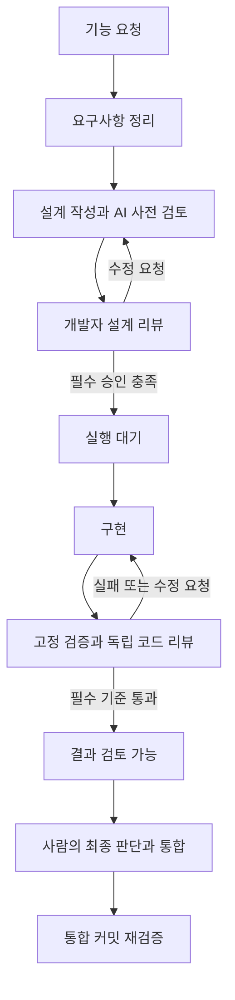
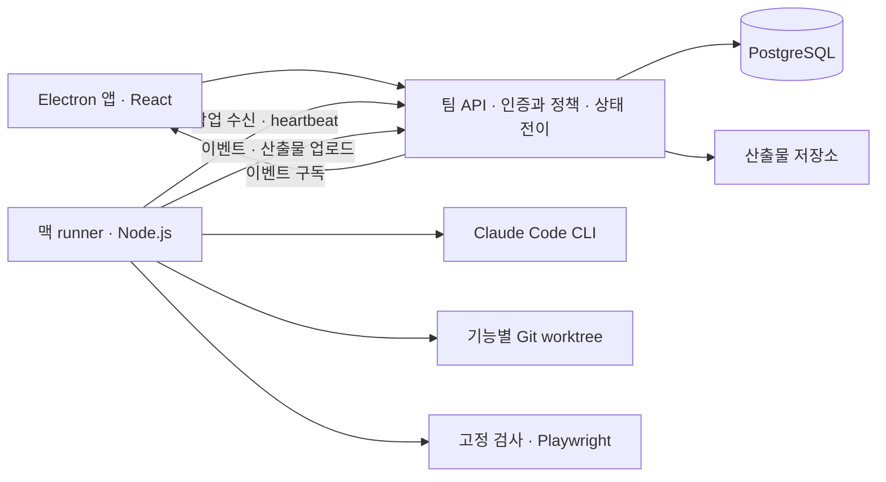

# 팀 표준 AI 개발 도구 — 요구사항과 설계

문서 버전: v0.1 · 작성: 2026-09-17 · 상태: **개발자 설계 리뷰 대기**

이 문서는 구현 착수를 위한 검토 대상이다. 앱·서버·에이전트 연동을 구현하거나 검증한 결과가 아니다. 이번 도구 자체도 사용자가 정한 ‘개발자 설계 승인 후 구현’ 절차를 따른다. 승인 대상과 기록은 [설계 리뷰 기록](DESIGN-REVIEW.md)에서 관리한다.

## 1. 제품 정의와 현재 결정

모든 개발자가 공통 개발 절차와 품질 기준으로 여러 프로젝트·기능을 동시에 개발하고, 진행 상황과 검증 근거를 실시간으로 확인하는 macOS 앱.

품질 표준화는 모든 결과물이 동일하다는 뜻이 아니다. 동일한 필수 검증·설계 리뷰·산출물 기준을 통과해야 결과를 제출할 수 있다는 뜻이다. 에이전트의 작업 방법에는 자율성을 주되, 설계 승인과 완료 조건은 프로그램이 관리한다.

### 사용자와 합의된 요구사항

| ID | 요구사항 | 완료를 판단할 관찰 기준 |
|---|---|---|
| R01 | 팀 공통 개발 절차·품질 기준 | 서로 다른 개발자가 같은 템플릿·필수 검사로 기능을 제출한다. |
| R02 | macOS 앱 | 설치 가능한 Electron 앱에서 주요 업무를 처리한다. 브라우저를 따로 열 필요가 없다. |
| R03 | 여러 프로젝트 | 프로젝트별 저장소·권한·지침·기능 목록을 분리한다. |
| R04 | 여러 기능 병렬 개발 | 독립된 기능을 동시에 실행하고 자원이 부족하면 이유와 함께 대기한다. |
| R05 | 실시간 진행·중간 결과 | 단계, 현재 행동, 마지막 활동, 문서, 변경 코드, 테스트 결과를 확인한다. |
| R06 | 범위별 지침 관리 | 전역·프로젝트·단계·역할·이번 작업 지침과 적용 버전을 조회한다. |
| R07 | 개발자 설계 리뷰 필수 | 최신 설계의 필수 승인 및 차단 이슈 해결 전에는 구현 실행을 거절한다. |
| R08 | 웹 시나리오 자동화 | 요구사항과 테스트를 연결하고 실제 브라우저 실행 결과·실패 근거를 수집한다. |
| R09 | 최소한의 중간 개입 | 승인 범위 안에서 구현·검증·수정을 반복한다. 결정이 필요한 사항만 요청한다. |
| R10 | 편리한 UI/UX | 검토할 일과 막힌 일을 먼저 보여주고 작업 전환 시 문맥을 보존한다. |
| R11 | 지속 기록·재개 | 앱 재접속과 실행 장애 후 기존 상태를 확인해 중복 실행 없이 복구한다. |

### 이번 설계에서 제안하는 선택

- Electron + React + TypeScript로 자체 앱을 만든다. Orca는 UX 참고 대상이며, 첫 버전이 Orca 설치나 비공개 API에 의존하지 않게 한다.
- 팀 공통 API와 PostgreSQL을 상태의 기준으로 둔다. 각 개발자 맥의 runner가 실제 CLI와 테스트를 실행한다. 첫 개발 환경에서는 API·DB·runner를 같은 맥에서 실행할 수 있다.
- 첫 에이전트는 설치된 Claude Code CLI를 프로그램에서 호출한다. 다른 공급자 어댑터는 후속 범위다.
- 초기 병렬 한도는 팀 2개 실행, runner당 2개 실행을 기본값으로 제안한다. 변경 가능한 설정이며 성능 보장이 아니다.
- 필수 설계 검토자는 프로젝트에서 지정한 사람 1명 이상이다. 팀 운영에서는 작성자 이외 검토자 1명 이상을 요구한다. 이번 도구 설계는 사용자가 검토한다.
- 첫 템플릿은 신규 기능과 버그 수정이다. 문서 분량은 다르지만 두 템플릿 모두 설계 승인을 거친다.

### 아직 실제 운영 연결이 필요한 정보

| 항목 | 현재 처리 | 필요한 시점 |
|---|---|---|
| 팀 이름·구성원·검토자 | 개발 fixture로 역할을 검증하고 실제 사용자와 구분 | 팀 파일럿 연결 전 |
| 팀 인증 제공자 | 운영은 OIDC 연결 제안, 개발은 loopback 전용 fixture 인증 | 팀 서버 외부 접속 전 |
| 적용 저장소·CI 제공자 | 전용 테스트 저장소로 검증. WORK의 다른 프로젝트는 자동 등록·수정하지 않음 | 첫 실제 프로젝트 등록 전 |
| 팀 서버 주소·상시 실행 장비 | 로컬 개발로 시작, 배포·상시 서비스 등록은 별도 작업 | 팀 파일럿 배포 전 |
| Claude 실행 인증·한도 | 기존 설치 탐지, 로그인·과금 정책을 바꾸지 않음 | 실제 유료 에이전트 실행 검증 전 |
| 제품 이름·배포 서명 | 코드명 team-devflow 제안, 정식 브랜드·서명은 미정 | 배포본 발행 전 |

위 정보가 없다는 이유로 도메인·UI·테스트 구현을 막지는 않는다. 대신 개발 fixture를 실제 팀 인증이나 실제 에이전트 성공으로 표시하지 않는다.

## 2. 첫 제품 범위와 개발 순서

첫 제품의 필수 범위는 팀 모델, 다중 프로젝트·기능, 설계 리뷰, 지침 버전, 실행 대기열, 실제 Claude 연결, 고정 검증, 실시간 결과와 복구다. 첫 내부 빌드와 팀 사용 가능한 파일럿을 구분한다.

| 단계 | 산출물 | 합격 조건 |
|---|---|---|
| M1: 설계 승인과 병렬 작업 기반 | Electron 앱, API·DB, 프로젝트·기능, 버전별 설계와 댓글·승인, 정책, 실시간 상태 | T01~T07, T10, T13, T14. 두 사용자 fixture와 두 앱 세션으로 검증. 실제 에이전트 실행은 아직 미연결로 표시 |
| M2: 실제 개발 한 사이클 | runner, Claude 어댑터, worktree, 고정 검사·Playwright, 수정 반복·중단·재개 | T08~T12, T15~T17. 전용 저장소에서 실제 두 기능 병렬 개발 및 결과 검증 |
| M3: 팀 파일럿 | 실제 팀 로그인·권한, 두 머신 동기화, CI 병합 조건, 맥 배포 패키지 | T18~T20 및 M1·M2 핵심 회귀. 조직 인증·CI 연결 검증 전에는 팀 운영 준비 완료로 표시하지 않음 |

후속 범위: 범용 시각적 워크플로 편집기, 자체 IDE 전체 기능, 무제한 에이전트 병렬화, 다수 모델 비교, 모바일 앱, Windows, 자동 병합·자동 운영 배포. 첫 버전은 결과와 PR 검토까지 지원하고 병합·배포를 임의 실행하지 않는다.

## 3. 개발 흐름과 설계 승인



요구사항에는 목표, 범위, 제외 범위, 수용 기준 ID, 예외·실패 상황을 적는다. 설계에는 영향받는 구성 요소, API·데이터 계약, 의존성, 예외 처리, 검증 계획, 필요한 배포·복구 계획을 적는다. 해당 없는 항목은 이유를 기록한다.

### 승인 계약

1. 게시한 설계 버전은 불변이다. `design_version_id`, 내용 해시, 요구사항 버전, 기준 코드 커밋, 정책 버전, 검토자 집합을 고정한다. 편집은 새 초안으로 이어진다.
2. AI 사전 검토는 의견이며 사람의 승인이 아니다. 에이전트 계정에는 승인 권한이 없다.
3. 댓글은 설계 버전·문단 ID·선택 인용문에 연결한다. 새 버전에서 위치가 사라지면 연결 불가 상태로 남기며 조용히 다른 문단에 붙이지 않는다.
4. 이슈는 차단 또는 참고로 분류한다. 구현자가 ‘수정 완료’를 제안하면 검토자가 해결을 확인한다. AI나 작성자 단독으로 차단 이슈를 닫아 통과할 수 없다.
5. 필수 검토자 모두의 승인, 미해결 차단 이슈 0건, 필수 체크 항목 검토 완료가 구현 시작 조건이다. 참고 의견은 남겨둘 수 있으나 미해결 상태를 표시한다.
6. 새 설계 버전 게시 시 초기 버전에서는 변경 크기와 무관하게 기존 승인을 재사용하지 않는다. 이전 버전과 처리된 의견을 나란히 보여 재리뷰 부담을 줄인다.
7. 요구사항·필수 정책·검토자 변경 또는 설계 기준을 바꾸는 선행 기능 통합도 승인 재평가 대상이다. 구현 중 설계 변경은 일시정지 요청부터 수행하고 runner 정지 확인 후 새 승인 기준을 적용한다. 정지를 확인하지 못하면 ‘정지 확인 중’으로 표시한다.
8. 실행 예약과 실제 dispatch 시 두 번 승인 조건을 확인한다. 예약 이후 승인 철회도 반영한다. UI 버튼뿐 아니라 서버와 runner 계약에서 차단한다.
9. 승인과 수정 요청은 사용자·시각·대상 버전·의견을 남긴다. 승인 철회도 별도 이벤트이며 과거 기록을 지우지 않는다.

세부 구현 선택은 승인된 요구사항·설계 범위 안에서 자율적으로 결정한다. 외부 API 계약·데이터 구조·권한·기능 범위가 바뀌는 경우에는 재설계로 돌아간다. 분류가 불확실한 경우 변경 영향과 선택지를 개발자에게 전달한다.

## 4. 상태 모델

한 문자열에 모든 의미를 넣지 않는다. 단계, 실행 상태, 리뷰 상태, 전달 상태를 분리해 저장하고 화면에서 조합한다.

| 구분 | 값 |
|---|---|
| 단계 phase | requirements, design, implementation, verification, code_review, delivery |
| 실행 execution_status | idle, queued, running, pause_requested, paused, blocked, recovering, failed, cancelled, completed |
| 설계 review_status | draft, in_review, changes_requested, approved, superseded |
| 전달 delivery_status | not_ready, ready_for_review, pr_open, merged, integrated_verified |

- requirements/design 실행 완료는 구현 승인과 다르다. 설계가 준비되면 개발자 리뷰 대기로 간다.
- `completed`는 해당 Run의 실행 종료다. 기능의 완료 표시는 최신 코드의 필수 검증·리뷰·승인과 전달 정책을 함께 만족할 때만 계산한다.
- 상태 표시에는 이유 코드와 설명이 있다. 예: `awaiting_design_approval`, `dependency_pending`, `runner_offline`, `capacity_exhausted`, `usage_limit`, `test_failure`.
- 연결 끊김을 실패나 완료로 단정하지 않는다. 마지막 확인 시각과 오래된 상태 표시를 제공한다.
- 검사 후 코드가 바뀌면 해당 결과는 stale로 남기고 새 버전에 대한 통과 근거로 사용하지 않는다.

## 5. 프로젝트·병렬 실행·통합

계층은 `Team → Project → Feature → Run → Step → Attempt`다. 역할별 AgentSession은 Attempt에 연결한다. 프로젝트는 논리적인 저장소 URL을 갖고 runner별 checkout 경로는 별도로 매핑한다.

각 Feature의 쓰기 실행에는 전용 worktree, `codex/<feature-id>-<slug>` 작업 브랜치, 포트 할당, 테스트 데이터 namespace를 배정한다. worktree는 파일 분리 수단이며 운영체제 권한 샌드박스가 아니다. 한 worktree에는 한 쓰기 소유자만 둔다. 사람이 직접 수정하려면 실행 중지·소유권 전환 후 재개한다.

의존성은 방향성 비순환 그래프로 관리한다. 초기에는 선행 기능이 통합·검증된 뒤 의존 기능의 쓰기 실행을 시작한다. 설계와 읽기 조사는 병렬로 가능하다. 선행 코드가 바뀌면 기준 커밋과 설계 영향을 확인한다. 복잡한 stacked branch 자동 재배치는 후속 범위다.

서로 독립된 기능은 병렬 실행한다. 팀·프로젝트·runner의 동시 실행 한도를 함께 적용하고, 수동 우선순위 안에서는 먼저 준비된 작업부터 선택한다. 특정 프로젝트가 대기열을 독점하지 않도록 프로젝트 간 순환 선택을 적용한다. 잠금이 필요한 공통 자원은 프로젝트 설정에 명시한다.

통합은 프로젝트별 직렬 대기열을 사용한다. 최종 병합 후보 커밋에서 전체 필수 검증을 다시 실행하고, 기준 브랜치가 이동하면 다시 검증한다. 개별 worktree 통과만으로 통합 성공을 표시하지 않는다. 첫 버전의 최종 병합은 사람이 수행한다.

## 6. 지침과 품질 기준

| 범위 | 내용 | 관리 권한 |
|---|---|---|
| 전역/팀 | 공통 개발 원칙, 필수 검사, 승인·권한 기준 | 팀 관리자 |
| 프로젝트 | 구조, 명령, 환경, 도메인 규칙, 추가 검토자 | 프로젝트 관리자 |
| 단계 | 설계 산출물, 리뷰 항목, 검증·완료 조건 | 템플릿 관리자 |
| 역할 | 계획·구현·리뷰 담당의 책임과 도구 범위 | 템플릿 관리자 |
| 이번 기능 | 승인된 목표·수용 기준·제약·보충 지시 | 담당 개발자, 중요 변경은 재리뷰 |

자연어 지침과 기계적으로 검사하는 정책을 구분한다. 자연어를 단순히 이어 붙이고 ‘뒤의 내용이 우선’이라고 가정하지 않는다.

- 필수 검사·승인 조건은 하위 범위에서 제거할 수 없고 추가만 가능하다.
- 도구 권한은 허용 범위의 교집합, 실행·시간 한도는 더 제한적인 값을 적용한다. 완화는 정책 관리자 변경과 영향을 받는 실행의 재평가가 필요하다.
- 기술 스택·명령 등의 프로젝트 설정은 스키마에서 허용한 항목만 덮어쓴다. 충돌하거나 정의되지 않은 값은 실행 전에 알려준다.
- 자연어 충돌이 발견되면 출처를 표시하고 정리한다. 발견하지 못한 모호함까지 자동으로 해결한다고 보장하지 않는다.
- Run 생성 시 적용 지침 본문·출처·버전·해시를 스냅샷으로 저장한다. 역할별 세션에는 필요한 부분과 문서 위치만 전달한다.
- CLAUDE.md와 관련 설정의 실제 로딩 여부도 어댑터가 기록한다. 앱 지침과 저장소 지침이 중복·충돌하는지 연결 시험에서 확인한다.
- 사용자의 추가 지시는 기본적으로 다음 작업 경계에서 반영하고, 긴급 변경은 일시정지 후 재계획한다.

## 7. 화면과 사용 경험

### 화면 구조

```text
┌ 팀 선택 ───────────── 검색 / 명령 ⌘K ───── 연결 상태 ┐
│ 내 할 일       │ 결제 오류 처리 / 설계 리뷰                │
│ 리뷰 요청  3   │ 요구사항 → 설계[검토 중] → 구현 → 검증    │
│ 진행 중        ├───────────────────────┬─────────────────┤
│ 막힌 작업      │ 설계 v3 / 이전과 비교 │ 리뷰 의견        │
│                │                       │ 차단 2 · 참고 1 │
│ 프로젝트 A     │ 요구사항·구조·API     │ 관련 문단 연결  │
│  기능 1 ● 구현 │ 데이터·예외·검증계획 │ 의견 처리 결과  │
│  기능 2 ◇ 리뷰 │                       │ 검토 체크리스트 │
│ 프로젝트 B     ├───────────────────────┴─────────────────┤
│  기능 3 … 대기 │ 저장됨 / 필수 승인 0/1 / 수정 요청·승인   │
│ 지침·팀 설정   │ 실행 상세(필요할 때 펼침)                 │
└────────────────┴─────────────────────────────────────────┘
```

1. **내 할 일:** 내가 검토해야 하는 설계·수정본, 나에게 돌아온 질문, 막힌 작업부터 표시한다. 팀 전체 현황은 별도 전환이며 개인 작업 목록과 혼동하지 않는다.
2. **프로젝트:** 기능별 단계, 담당자, 실행 상태, 마지막 활동, 의존성, 다음 행동을 행 중심으로 표시한다. 목록/보드 전환을 제공하되 동일 필터·선택을 유지한다.
3. **기능 작업 화면:** 상단은 단계와 상태, 중앙은 산출물, 오른쪽은 검토·질문. 터미널은 하단 확장 패널로 둔다. 단계 선택은 관찰 대상만 바꾸며 실제 상태를 바꾸지 않는다.
4. **설계 리뷰:** 문단 댓글, 이전 버전과 비교, 미해결 의견, 항목별 검토, 수정 요청과 승인을 한 화면에 둔다. 승인 버튼이 비활성인 이유를 구체적으로 표시한다.
5. **검증 결과:** 테스트 이름, 연결된 수용 기준, 통과/실패/미실행/skip/stale, 실패 단계, 로그·화면·trace를 제공한다. 실시간 미리보기와 과거 검증 화면을 구분한다.
6. **지침 관리:** 범위별 편집, 변경 이력, 적용 미리보기, 영향을 받는 작업 목록. 일반 개발자는 적용 결과를 쉽게 볼 수 있고 관리자 기능은 분리한다.

### 인터랙션 계약

- 프로젝트/기능 변경 시 문서 탭, 스크롤, 분할 폭, 작성 중 의견을 유지한다. 댓글 초안은 로컬에 저장하고 게시한 댓글만 팀에 공유한다.
- 설계 초안의 서버 저장은 revision 비교를 사용한다. 다른 사람이 변경했다면 덮어쓰지 않고 충돌과 양쪽 내용을 보여준다.
- 상태 변화는 현재 선택·스크롤·포커스를 빼앗지 않는다. 정렬 변경은 새 항목 표시 후 사용자가 반영하도록 한다.
- 검토 요청, 수정 완료, 사용자 판단 필요, 최종 완료만 기본 알림 대상이다. 실행 로그마다 알리지 않는다. 알림은 정확한 기능·문단·테스트로 이동한다.
- macOS 표준 창 제어, ⌘K 검색, ⌘1~3 주요 화면, ⌘Enter 댓글 제출을 제공한다. 승인처럼 중요한 동작은 별도 명시 버튼으로 수행한다.
- 승인/실행 요청 응답을 받기 전에는 성공으로 표시하지 않는다. 중복 클릭은 요청 ID로 중복 처리를 막는다.
- 연결 끊김에는 마지막 동기화 시각을 표시한다. 캐시 조회와 초안 작성은 가능하지만 오프라인 승인·실행·정책 게시를 허용하지 않는다.
- 창 닫기는 화면만 닫고 runner 실행을 유지하는 구성을 제안한다. 앱 완전 종료 메뉴는 로컬 실행이 있으면 ‘화면만 닫기 / 실행을 멈추고 종료’의 결과를 명시한다. OS 강제 종료·절전 때 실행 지속을 보장하지 않는다.

### 시각 디자인 기준

Orca의 작업 공간·패널 구성과 Graphite의 리뷰 인박스를 참고한다. 독자적인 중심 요소는 ‘승인된 설계와 현재 구현·검증 근거의 연결’이다. 터미널 타일을 첫 화면 전체에 늘어놓지 않는다.

제안 토큰: 배경 `#F6F7F9`, 표면 `#FFFFFF`, 본문 `#20242B`, 구분선 `#DCE1E8`, 선택·포커스 `#245BC5`, 통과 `#18745D`. 경고와 실패는 별도 상태 색상과 아이콘·문구를 함께 사용한다. 다크 모드는 역할별 대응 토큰을 정의해 검증한다.

글꼴은 macOS 시스템 글꼴과 한국어 fallback, 명령·코드는 시스템 고정폭 글꼴을 사용한다. 본문 14px, 보조 12px, 문서 15px를 시작점으로 한다. 실제 앱에서 가독성과 대비를 확인해 조정한다. 고밀도 목록, 읽기 편한 문서, 조절 가능한 리뷰 패널을 우선하며 장식용 KPI·그라데이션·자동 애니메이션을 넣지 않는다.

기준 창은 1440×900, 최소 지원 창은 1024×700이다. 폭이 부족하면 오른쪽 패널을 접고 검토 탭으로 전환한다. 키보드 탐색·포커스·스크린리더 이름·밝은/어두운 테마를 검사한다. 모바일은 첫 범위가 아니다.

사용성 목표(아직 측정되지 않음): 처음 연 개발자가 10초 안에 자신의 다음 행동을 찾기, 목록에서 관련 문서·실패 증거까지 2번 이내 이동, 두 프로젝트의 기능 5개를 오가도 댓글 초안 손실 없음. 최소 두 개발자가 실제 시나리오로 평가한다.

## 8. 시스템 구성



| 구성 | 선택 제안 | 책임 |
|---|---|---|
| Desktop | Electron, React, TypeScript, Electron Forge | 창·앱 메뉴·알림, 작업과 리뷰 UI, 제한된 IPC |
| API | Node.js, TypeScript, Fastify | 인증·권한, 승인·정책, 실행 대기열, 이벤트, 산출물 접근 |
| 저장 | PostgreSQL | 팀 전체의 정합성, 버전, 실행 잠금, 이력 |
| Runner | 독립 Node.js 프로세스 | 로컬 환경 준비, CLI·검증 실행, 중단·복구, 로컬 이벤트 임시 보관 |
| 결과 저장 | 초기 API 호스트 디스크 + 메타데이터 DB | 로그·이미지·trace 저장, 향후 객체 저장소로 교체 가능 |
| 동기화 | HTTP 명령 + SSE 이벤트 | 명령과 상태 구독 분리, 재접속 시 이벤트 재전송 |
| 검증 | 도메인·API 테스트 + Playwright | 승인·병렬성·권한·복구와 사용자 시나리오 검증 |

Electron renderer는 파일 시스템이나 셸을 직접 호출하지 않는다. main/preload는 허용된 앱 기능만 노출하고, `contextIsolation`·sandbox를 켠다. 임의 경로 열기·임의 셸 문자열 실행 IPC를 제공하지 않는다. 프로젝트 미리보기는 권한 없는 별도 콘텐츠 영역에서 연다.

첫 실행 관리자는 API 프로세스 안의 작은 scheduler로 구현하되 핵심 상태 전이는 독립 도메인 모듈에 둔다. 다중 scheduler가 떠도 DB lease를 통해 한 작업에 한 소유자만 배정한다. 초기부터 Temporal 운영을 도입하지 않는다. 머신·재시도 규모가 커지면 같은 계약 뒤에서 교체한다.

API 호스트 디스크는 중앙 저장소이지 개발자 로컬 경로가 아니다. runner는 결과를 업로드하고 해시·크기 확인이 완료된 뒤에만 공유 가능한 Artifact로 등록한다. 대용량 파일 업로드 실패는 재시도하며 증거 미완료로 표시한다.

## 9. 데이터와 API 계약

| 엔터티 | 주요 필드·불변 조건 |
|---|---|
| Team, Membership | 사용자·역할·접근 프로젝트. 모든 요청은 팀 범위를 검사 |
| Project, RunnerCheckout | 저장소 ID·기준 브랜치·검사 설정·runner별 실제 경로 |
| Feature, Dependency | 수용 기준·담당자·단계·의존성. 순환 의존 거절 |
| PolicyVersion, EffectivePolicy | 범위·본문·구조화된 규칙·해시·출처. 게시 버전 불변 |
| RequirementVersion, DesignVersion | 불변 본문·해시·연결 버전·기준 커밋·검토자 |
| ReviewThread, ReviewDecision | 문단 anchor·차단 여부·해결 확인자·승인 버전·승인 주체 |
| Run, Step, Attempt | 기능·단계·세션·명령 ID·상태·시도 번호·lease generation |
| Runner, Lease | 머신·capability·heartbeat·유효 시간·단일 쓰기 소유자 |
| Event | 서버 순번·run/attempt·발생 시각·수신 시각·출처·중복 방지 키 |
| Artifact, Verification | 내용 해시·업로드 상태·commit/tree·환경 fingerprint·정책·설계 버전·검사 결과 |
| Integration | 대상 브랜치·후보 커밋·PR 참조·통합 검사 상태 |

API 초안:

| 명령/조회 | 예시 경로 | 핵심 검사 |
|---|---|---|
| 프로젝트·기능 관리 | `/projects`, `/projects/:id/features` | 소속·권한·revision |
| 설계 초안 저장·게시 | `/features/:id/designs`, `/designs/:id/publish` | 동시 편집 충돌·필수 항목 |
| 댓글·해결 확인 | `/designs/:id/threads`, `/threads/:id/resolve` | 작성·검토 권한·대상 버전 |
| 승인·수정 요청·철회 | `/designs/:id/reviews` | 사람 identity·필수 검토자·차단 이슈 |
| 구현 실행 요청 | `/features/:id/runs` | 승인·정책·의존성·중복 요청 |
| 일시정지·재개·취소 | `/runs/:id/commands` | 현재 revision·소유자·단계 전이 |
| 적용 지침 조회 | `/runs/:id/effective-policy` | 실행에 고정한 버전 반환 |
| 이벤트 구독 | `/events?after=:sequence` | 팀/프로젝트 권한·재전송 |
| runner claim·보고 | `/runner/claims`, `/runner/events` | scoped credential·lease generation·중복 이벤트 |
| 결과 업로드·조회 | `/artifacts`, `/artifacts/:id` | run 소유권·해시·다운로드 권한 |

서버는 승인·실행 상태와 대응 이벤트를 한 DB 트랜잭션에서 기록한다. 변경 명령은 idempotency key와 expected revision을 받는다. 승인 대상 변경은 충돌로 응답하고 새 버전으로 자동 승인하지 않는다. UI는 사람이 이해할 사유와 다음 행동을 보여준다.

## 10. 실제 에이전트 연결과 복구

Claude 어댑터는 `start`, `observe`, `requestPause`, `cancel`, `resume`, `capabilities` 계약을 제공한다. 실제 지원이 없는 기능은 숨기거나 제한을 표시한다. 설치된 CLI의 버전·모델 설정·cwd·세션 ID·로딩된 지침·도구 정책을 기록한다.

CLI는 인자 배열로 호출하며 문자열 셸 연결을 피한다. 구조화된 출력과 세션 참조를 사용하고, 전역 ‘최근 세션’에 의존하지 않는다. 터미널과 동일한 계정·설정이 자동 적용된다고 가정하지 않으며 연결 시험으로 확인한다. 인증은 runner에 보관하고 중앙 서버·로그로 토큰을 보내지 않는다.

설계 단계는 읽기 도구만 제공하고 대상 저장소를 수정하는 셸·편집 도구를 허용하지 않는다. 설계 산출물은 구조화된 응답을 API가 저장한다. 구현 도구를 가진 세션은 승인 확인 후에만 시작한다. 정책 우회 옵션을 사용하지 않는다. 역할 지침만으로 쓰기 금지를 보장한다고 주장하지 않는다.

runner는 5초 간격 heartbeat, 30초 lease를 초기값으로 제안한다. 일시적 통신 장애에는 짧은 간격부터 최대 30초까지 backoff한다. lease가 만료되면 새 작업과 후속 도구 실행을 진행하지 않고 실행 중지·복구로 전환한다. 오래된 generation의 결과는 감사 기록에만 남기며 최신 실행 상태를 바꾸지 못한다.

연결이 끊긴 프로세스는 살아 있을 수 있다. 새 쓰기 실행을 시작하기 전에 기존 프로세스 그룹·세션·worktree 소유권을 확인하고 종료 또는 재연결을 확정한다. 확인할 수 없으면 blocked로 유지한다. 외부 효과는 정확히 한 번을 가정하지 않고 PR 등의 기존 결과를 조회해 중복을 방지한다.

일시정지는 다음 안전한 경계에서 실행을 멈추고 변경·진행 기록을 저장한다. 즉시 취소는 process group 종료 후 상태와 미커밋 변경을 보존한다. 강제 reset·작업 폴더 삭제는 복구 기본 동작으로 사용하지 않는다.

네트워크 오류 재시도와 코드 수정 시도는 별도 집계한다. 같은 실패·같은 접근·새 근거 없음이 3회 반복되면 자동 작업을 중지하고 시도·원인·필요한 결정을 제시한다. 시간·동시 실행 한도는 강제하고, 비용을 정확히 관측하지 못하면 추정임을 표시한다. 승인 대기 시간은 에이전트 실행 시간을 소비하지 않는다.

## 11. 테스트와 완료 근거

요구사항 수용 기준 → 시나리오 → 실행 결과 → 화면·trace를 연결한다. AI는 시나리오 초안·탐색·실패 분석을 돕고, 반복 회귀 검증은 저장된 테스트와 고정 명령으로 수행한다. 로그인·역할별 계정·데이터 준비와 해제를 프로젝트 설정에 포함한다.

통과 조건은 최신 코드, 승인된 설계, 적용 정책, 검증 환경이 일치하는 필수 검사 결과다. 프로세스 종료 코드 0이나 AI의 완료 문구만으로 통과하지 않는다. 필수 검사 미실행·skip, 테스트 삭제·기대값 약화, 누락된 증거는 완료를 막는다. 정당한 테스트 변경은 설계/검토 근거와 함께 승인한다.

리뷰 에이전트는 승인 명세·diff·관련 코드·검증 근거를 읽으며 구현자의 요약만으로 판단하지 않는다. LLM 리뷰도 누락 가능성이 있으므로 기계적 검사와 사람의 최종 판단을 대체하는 보증으로 표현하지 않는다.

CI는 최신 PR 커밋과 승인·정책·검증 정보를 서버에서 다시 조회한다. 저장소 안의 ‘approved’ 파일을 신뢰하지 않는다. 보호 브랜치의 필수 검사 설정이 없으면 앱 밖 병합을 막을 수 없으므로 ‘병합 보호 미연결’로 표시한다. 로컬 머신 소유자의 임의 변경까지 원천적으로 방지하는 제품은 아니다.

## 12. 인수 시나리오와 추적

아래 항목은 실행할 테스트 계획이며 현재 통과 결과가 아니다.

| ID | 시나리오 | 예상 결과 | 요구사항 |
|---|---|---|---|
| T01 | 두 사용자가 같은 템플릿으로 기능 생성 | 동일 필수 항목·정책 적용, 사용자별 권한 유지 | R01,R06 |
| T02 | 승인 없는 설계에서 직접 API 실행 요청 | 구현 세션·쓰기 작업 미생성, 차단 이유 반환 | R07 |
| T03 | AI 계정 승인, 작성자 단독 승인, 차단 의견 미해결 | 모두 구현 조건 충족으로 계산되지 않음 | R07 |
| T04 | 두 필수 검토자 중 한 명 승인 후 나머지 승인 | 마지막 조건 충족 전 대기, 이후 실행 가능 | R07 |
| T05 | 승인 후 설계 v2 게시 또는 승인 철회 | v1 승인 재사용 불가, 예약 작업도 시작하지 않음 | R07 |
| T06 | 설계 초안 동시 저장, 댓글 위치 삭제 | 덮어쓰기 방지, 충돌·연결 불가 의견 보존 | R07,R10 |
| T07 | 하위 지침에서 필수 검사 삭제·권한 확대 시도 | 거절, 원인과 지침 출처 표시 | R01,R06 |
| T08 | 두 프로젝트·같은 프로젝트의 독립 기능 실행 | 각각 별도 worktree·세션·포트·데이터 사용 | R03,R04 |
| T09 | 한도 초과·순환 의존·선행 작업 대기 | 한도만큼 실행, 사유 표시, 순환 거절 | R04 |
| T10 | 두 앱 세션에서 승인·상태 변경과 재접속 | 같은 기준 상태, 중복 이벤트 없이 누락 복구 | R05,R11 |
| T11 | 브라우저 시나리오 실패 후 수정 | 실패 근거 표시, 재검증 통과 전 완료 불가 | R08,R09 |
| T12 | 통과 후 코드 변경, 필수 테스트 skip | 기존 근거 stale, 필수 누락으로 완료 차단 | R01,R08 |
| T13 | 밝은/어두운 테마·최소 창·키보드 리뷰 | 읽기·댓글·비교·승인이 가림이나 포커스 손실 없이 가능 | R02,R10 |
| T14 | 프로젝트 전환·초안·검토 알림 이동 | 문맥 보존, 정확한 리뷰 위치로 이동 | R05,R10 |
| T15 | API/runner crash·lease 만료·오래된 완료 이벤트 | 중복 쓰기 없음, 과거 결과가 새 상태를 덮지 않음 | R04,R11 |
| T16 | 반복 실패·사용량 제한·일시정지·취소 | 무한 반복 없이 기록 보존, 가능한 독립 작업 계속 | R09,R11 |
| T17 | 두 기능 통합·기준 브랜치 이동·통합 실패 | 최종 후보 재검증, 개별 성공을 통합 성공으로 오인하지 않음 | R01,R04 |
| T18 | 실제 두 사용자·두 머신·프로젝트 접근 권한 | 팀 상태 공유, 비인가 설계·로그·산출물 접근 거절 | R01,R03,R05 |
| T19 | 앱 밖 PR·옛 커밋 검사·서버 연결 실패 | CI에서 승인·최신 근거 없으면 병합 조건 미충족 | R01,R07 |
| T20 | 설치 패키지에서 로그인·재실행·실제 CLI 경로 | 앱 실행·환경 탐지·상태 복구. 미서명 배포는 별도 표시 | R02,R11 |

성능 목표는 검증 조건과 함께 측정한다. 개발 fixture 3프로젝트·100기능·2실행, 정상 LAN에서 서버 수신 후 화면 반영 p95 2초 이내, 캐시된 기능 전환 p95 300ms 이내를 제안한다. 제품 품질을 이 숫자만으로 판단하지 않으며 아직 측정한 값이 아니다.

## 13. 구현 구조와 검토 순서

승인 후 별도 하위 폴더 `ai-development-process/team-devflow/`에 구현한다. WORK 루트의 다른 미추적 프로젝트나 Git 설정을 변경하지 않는다. 패키지 정확한 버전은 구현 시작 시 호환성을 확인한 뒤 lockfile에 고정한다.

```text
team-devflow/
  apps/desktop/          Electron main·preload·React UI
  apps/server/           팀 API·scheduler·인증
  apps/runner/           CLI·Git·검증·프로세스 관리
  packages/domain/       승인·상태·정책·의존성의 순수 규칙
  packages/contracts/    명령·이벤트·API 스키마
  packages/database/     스키마·migration·repository
  tests/fixtures/        사용자·저장소·시나리오 (개발 전용)
  tests/integration/     권한·동시 실행·복구
  tests/e2e/             실제 앱 사용자 흐름
```

M1 구현 순서: 도메인과 승인 조건 → DB/API와 트랜잭션 → 앱 셸·리뷰 인박스 → 기능·설계 상세 → 실시간 동기화 → 두 사용자·두 앱 세션 검증. UI의 가짜 타이머로 진행 상태를 흉내 내서 실연동으로 보고하지 않는다.

M2 구현 순서: runner claim·세션 수명 → Claude 읽기 연결 검사 → 승인된 구현 실행 → 검증/수정 반복 → 두 기능 병렬·복구. 실제 실행 시험에서는 전용 저장소와 제한된 작업 범위를 사용한다.

초기 검토 질문은 세 가지로 묶는다: (1) Electron 앱+팀 서버+맥 runner 구성이 맞는가, (2) 사람의 버전별 설계 승인 계약이 충분한가, (3) M1~M3 범위가 목표에 맞는가. 배포 연결 정보는 해당 단계에서만 수집한다.

## 14. 근거와 현재 검증 범위

기술·UX 자료는 2026-09-17 확인했다. 아래는 기능과 설계 원칙의 참고 근거이며 위 상태·API·DB·화면 설계는 이 프로젝트의 제안이다.

- [Orca](https://www.onorca.dev/): 작업별 공간, 분할 화면, 문서·코드 변경·브라우저와 의견 전달을 참고한다. 코드 포크는 현재 범위에 없다.
- [Graphite 리뷰 인박스](https://graphite.com/docs/use-pr-inbox): 검토 요청·반환·승인 상태를 모아 보는 방식 참고.
- [Electron 프로세스](https://www.electronjs.org/docs/latest/tutorial/process-model), [Electron 보안](https://www.electronjs.org/docs/latest/tutorial/security), [Electron Forge](https://www.electronforge.io/): 화면·권한 경계·패키징 참고.
- [Claude 프로그램 실행](https://code.claude.com/docs/en/headless), [권한](https://code.claude.com/docs/en/permissions): CLI 구조화 출력·세션·도구 연결. 실제 설치 버전 지원은 M2에서 시험한다.
- [PostgreSQL SELECT와 잠금](https://www.postgresql.org/docs/current/sql-select.html), [Fastify](https://fastify.dev/docs/latest/): 서버·작업 획득 설계 참고. DB 잠금만으로 외부 효과의 정확히 한 번 실행을 보장하지 않는다.
- [Playwright reporters](https://playwright.dev/docs/test-reporters): 구조화된 테스트 결과와 사용자용 보고서를 함께 수집.

현재 확인: 기존 작업 폴더에는 조사·제안 Markdown만 있다. 셸에서 node·pnpm·npm·git·docker·claude 실행 파일 경로를 찾았다. 이는 Docker 가동, Claude 로그인·한도, 버전 호환성, 실제 에이전트 연결이 검증됐다는 뜻이 아니다.

현재 미확인: 앱 실행, API/DB 가동, 승인 조건 강제, 병렬 실행, 실시간 동기화, 테스트·복구, 실제 팀 인증, CI와 서명 배포. 모두 구현 후 위 시나리오로 검증한다.
