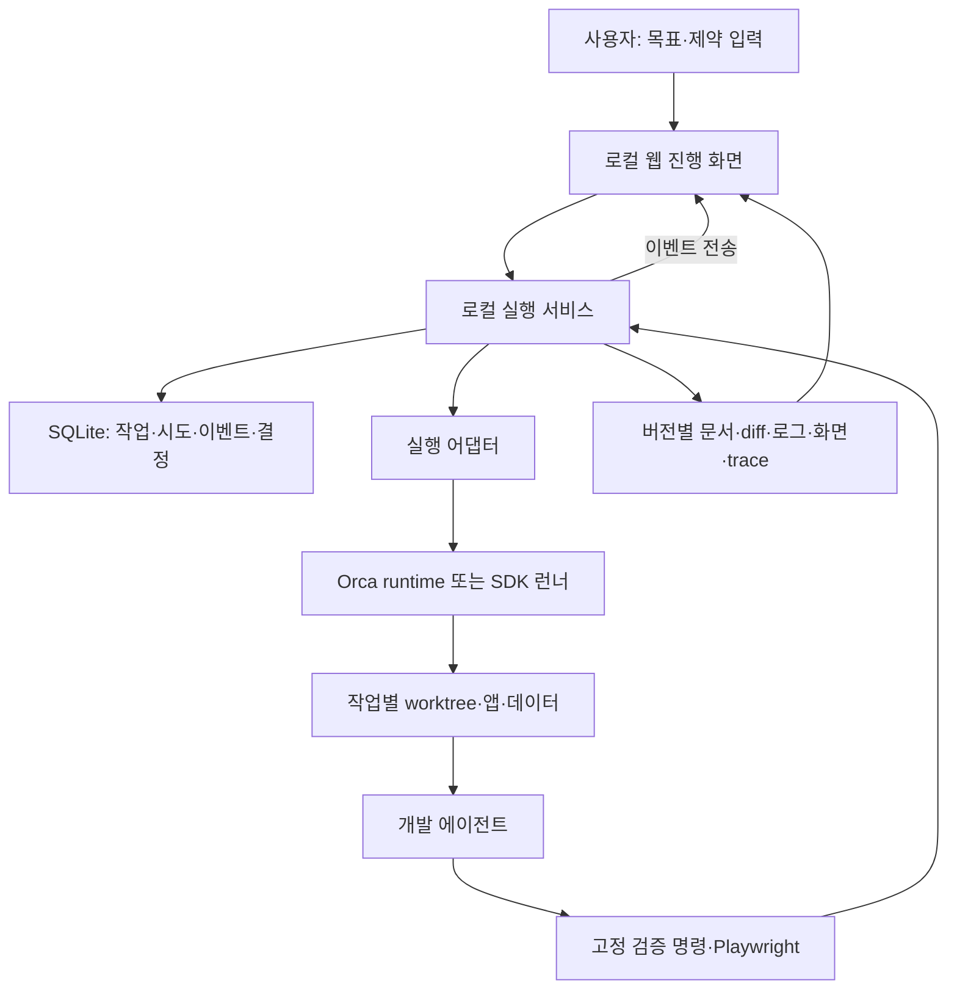

# 구현 방식 추천: Orca + 로컬 실행 서비스 + 웹 진행 화면

> 초기 선택지 비교 기록이다. 이후 합의한 팀용 Electron 앱·공통 서버·기능별 병렬 실행·개발자 설계 승인 요구는 [현재 제품 설계](../design/PRODUCT-DESIGN.md)를 따른다. 아래 로컬 웹 우선 추천과 단계 순서는 현행 결정이 아니다.

조사·작성: 2026-09-17. 구현 전 제안이며, 실제 설치·연결·테스트 결과가 아니다.

## 1. 추천 결론

개인 또는 소규모 팀이 로컬에서 시작한다는 조건에서는 **기존 Orca를 활용하고, 개발 단계와 검증 증거를 관리하는 작은 서비스를 붙이는 방식**을 추천한다. 진행 화면은 로컬 웹으로 만들고 Orca 브라우저나 일반 브라우저에서 연다. 새 macOS 앱 제작은 이 구조의 유용성이 확인된 다음에 결정한다.

구현할 핵심은 목표 → 명세 → 구현 → 검증 → 수정 → 결과 전달을 연결하는 실행 서비스다. 이미 사용하는 에이전트의 편집·명령 실행 기능과 Orca의 터미널·diff·브라우저는 재사용한다.

**Orca 식별은 미확정이다.** 동명 프로젝트가 여러 개 있으므로 아래 Orca 제품 설명은 `onorca.dev / stablyai/orca`를 기준으로 한다. 사용 중인 제품 URL·버전은 아직 확인하지 못했다. 현재 셸 PATH에서도 `orca`를 찾지 못했으며, 이는 앱이 설치되지 않았다는 증거가 아니다. 제품이 다르면 연결 어댑터를 바꾸고 나머지 구조는 유지한다.

## 2. 확정·제안·미정

| 구분 | 내용 |
|---|---|
| 확정 | 요구·설계·개발·리뷰·테스트를 연결, 중간 개입 최소화, 웹 테스트 자동화, 진행과 중간 산출물 조회 |
| 사용자 환경 | 로컬에서 Orca 사용 중 |
| 제안 | Orca 재사용, 로컬 서비스, 웹 화면, 단일 프로젝트·단일 구현 작업부터 검증 |
| 미정 | Orca 제품·버전, 첫 적용 저장소, 주력 에이전트, 팀 공유 필요, 밤에도 켜둘 실행 머신 |

## 3. 실제 회사들은 어떤 형태로 구현했는가

공개 운영·담당자 경험만 요약했다. 전사 표준이나 모든 작업의 완전 무인화를 뜻하지 않는다.

| 사례·게시일 | 확인한 구현과 사용 방식 | 가져올 원칙 |
|---|---|---|
| [Ramp Inspect · 2026-01-12](https://engineering.ramp.com/post/why-we-built-our-background-agent) | 세션별 Modal VM, OpenCode 실행, 공통 API 위에 웹·Slack·확장 프로그램. 웹에서 미리보기·화면·원격 편집 제공 | 실행 환경과 화면을 분리하고 같은 작업 상태를 여러 화면에서 봄 |
| [Stripe Minions · 2026-02-19](https://stripe.dev/blog/minions-stripes-one-shot-end-to-end-coding-agents-part-2) | 표준 devbox에서 실행. 코드로 정의한 Blueprint가 에이전트 작업과 고정 절차를 결합 | 구현 판단은 AI, 필수 검사·상태 전이는 프로그램 |
| [Spotify · 2026-06-03](https://engineering.atspotify.com/2026/6/code-with-claude-coding-is-no-longer-the-constraint) | 기존 개발 플랫폼과 Fleetshift에 Honk 연결. 대상·진행·생성/병합 PR·주의할 항목 조회 | 익숙한 작업 화면에 진행 상태를 통합 |
| [Anthropic · 2026-06-23](https://www.anthropic.com/news/introducing-claude-tag) | 내부에서도 Slack의 Claude Tag에 일을 위임하고 비동기로 진행. 결과를 대화 맥락에 돌려줌 | 사용자는 익숙한 접점에서 요청·방향 수정·결과 확인 |
| [OpenAI 담당자 사례 · 2026-08-25](https://learn.chatgpt.com/blog/automating-repetitive-work-at-openai-with-codex) | 평가 업무를 Codex와 Runme 웹 노트북으로 수행. 계획·명령·출력·결정 이유를 한 산출물에 기록하고 중간에 확인 | 터미널 로그를 넘어 단계별 결과를 읽을 수 있게 함 |
| [Uber · 2026-08-27](https://www.uber.com/us/en/blog/efficient-software-factory/) | 리뷰·CI 복구·시각 검증 등 관리형 에이전트와 실행·비용 관찰. 결과당 비용과 품질 측정 | 실행 시간보다 검증된 결과와 재작업을 측정 |

**조사에 근거한 판단:** 대기업의 공통점은 단일 UI 프레임워크가 아니라 실행·상태·도구·검증을 연결하는 기반에 있다. 개인에게는 이 구조를 한 머신에서 작게 시작하는 편이 적합하다. Ramp가 개발 환경에 Temporal을 둔다는 사실만으로 Inspect의 실행 관리자가 Temporal이라고 단정하지 않는다.

Stripe는 공식 HTML에 포함된 본문을 확인했다. Ramp는 공식 도메인의 검색 색인 본문을 사용했다. 회사 수치와 자체 보고의 한계는 [전체 조사](RESEARCH-2026-09-17.md)를 따른다.

## 4. 선택지 비교

아래 평가는 현재 목표에 대한 설계 판단이다. 제품의 보편적인 우열이나 성능 벤치마크는 아니다.

| 방식 | 잘 맞는 경우 | 추가로 해결할 일 | 지금 판단 |
|---|---|---|---|
| Orca + 지침·스크립트만 | 한 작업의 흐름을 빠르게 시험 | 단계별 완료 판정, 재개, 증거 집계 | 첫 검증에 사용 |
| **Orca + 작은 로컬 서비스 + 웹 화면** | 반복 개발, 진행·중간 결과 조회 | 서비스와 Orca 연결, 상태 복구 | **추천 목표 구조** |
| n8n 같은 시각적 워크플로 도구 중심 | 업무 이벤트·알림·외부 시스템 연결 | 코드 작업 공간, 에이전트 세션, 검증 의미를 별도 구현 | 외부 연결이 필요할 때 보조 계층으로 검토 |
| GitHub Actions 같은 CI 중심 | 커밋·PR 단위의 반복 검사 | 로컬 작업 맥락·진행 중 상호작용 | 최종 검증 경로로 활용 |
| 처음부터 자체 웹 SaaS | 여러 사용자의 공유 실행·권한·원격 환경 필요 | 계정·런너·원격 미리보기·운영 | 팀 요구가 명확해지면 확장 |
| 처음부터 SwiftUI macOS 앱 | 네이티브 편집·OS 연동이 핵심 제품 가치 | UI 외에도 동일한 실행 서비스 필요 | 현재는 후순위 |

워크플로는 반드시 사용한다. 초기에는 저장소에서 검토 가능한 설정과 일반 코드로 구현한다. 시각적 편집기까지 만드는 것은 초기 범위에 넣지 않는다.

## 5. Orca에서 재사용할 것과 확인할 것

공식 문서상 작업별 worktree·터미널·브라우저, 파일·diff 보기, CLI 제어 기능이 있다. [Orca 소개](https://www.onorca.dev/docs), [CLI](https://www.onorca.dev/docs/cli/overview)

진행 피드는 실행 중·완료·입력 대기와 응답 미리보기를 모은다. 이것을 활용하고, 우리 화면은 요구사항별 검증 결과와 단계별 산출물에 집중한다. [Agents feed](https://www.onorca.dev/docs/activity)

오케스트레이션에는 Run·Task·Dispatch·메시지·결정 게이트가 있지만 **실험 기능**이다. Run 자체가 작업을 스케줄하거나 워커를 배치하지 않는다. CLI는 살아 있는 Orca runtime을 사용한다. 그러므로 전체 개발 흐름을 자동으로 수행하는 제어 루프와 완료 판정은 별도로 연결·검증해야 한다. [Orchestration](https://www.onorca.dev/docs/cli/orchestration)

우리 서비스가 상위 단계 전이와 최종 완료 판정을 소유하고, Orca는 실행 시도와 작업 환경을 소유하게 한다. Orca ID를 참조로 보존하고 같은 워커를 양쪽에서 독립적으로 재시작하지 않는다. 완료 메시지를 받으면 테스트 증거를 확인한 후 상위 단계를 전진시킨다.

첫 연결 검증에서는 실행 요청, 상태 읽기, 완료·차단 이벤트, 중단, 재접속, 중간 파일 열기만 확인한다. 공개 CLI로 충분하면 Orca를 수정하지 않는다. 필요한 기능이 없으면 그 부분만 SDK 실행 어댑터로 대체한다. Orca 내부 DB·비공개 프로토콜에 의존하지 않는다.

## 6. 권장 아키텍처

초기 기술 제안:

| 구성 | 선택안 | 이유 |
|---|---|---|
| 진행 화면 | React + Vite | 로컬 브라우저와 추후 앱 포장에서 재사용 |
| API·실행 관리자 | TypeScript + Node.js, 작은 HTTP 서버 | 에이전트 연결·프로세스 실행·웹 화면의 타입 공유 |
| 상태 저장 | SQLite, 단일 작성자 | 한 머신의 작업·시도·이벤트를 지속 저장 |
| 로그·큰 산출물 | run별 로컬 폴더, DB에는 참조·해시 | 화면·trace를 DB에 모두 넣지 않음 |
| 실시간 표시 | SSE + 일반 HTTP 명령 | 이벤트 수신과 시작·중단 요청 분리 |
| 개발 실행 | 우선 Orca 공개 CLI 어댑터 | 사용 중인 작업 화면과 환경 재사용 |
| 웹 검증 | Playwright + 프로젝트의 기존 테스트 | 시나리오 실행과 기계 판독 결과 수집 |

이는 권장 구현안이며 이미 연결되어 있다는 뜻은 아니다. 프로젝트별 검증 명령과 작업 공간 소유자는 명시적으로 고정한다.

### SDK를 직접 연결해야 할 경우

Codex 공식 문서는 배치 작업·CI 자동화에는 SDK, 인증·이력·승인·이벤트를 포함한 자체 클라이언트에는 App Server를 안내한다. 초기에는 필요한 작업 제어만 SDK 어댑터로 제공한다. 풍부한 자체 대화 화면을 만들 때 App Server를 평가한다. 현재 문서는 App Server 명령·WebSocket 전송의 실험 상태를 명시하므로 버전 고정과 호환성 검증이 필요하다. [Codex SDK](https://learn.chatgpt.com/docs/codex-sdk), [App Server](https://learn.chatgpt.com/docs/app-server)

Claude는 Agent SDK로 도구 실행·세션·스트리밍·권한 처리를 연결할 수 있다. 두 에이전트 모두 처음부터 지원할 필요는 없다. 지금 가장 자주 쓰는 하나로 시작하고, 인증·과금 방식은 선택한 실행 경로에서 확인한다. [Claude Agent SDK](https://code.claude.com/docs/en/agent-sdk/overview)

브라우저에서 에이전트를 직접 실행하지 않고 서비스가 실행 어댑터를 호출한다. 모델 API만으로 파일 편집·셸·컨텍스트 관리 전체를 다시 만드는 것은 초기 범위에 넣지 않는다.

## 7. 화면에서 보여줘야 할 것

화면의 중심은 한 작업의 실행 기록이다. 단계 탭을 누르면 해당 시점의 문서·변경·증거를 연다.

| 화면 영역 | 내용 |
|---|---|
| 작업 목록 | 실행 중 / 입력 필요 / 검토 가능 / 완료 / 중단, 마지막 실제 활동 |
| 단계 표시 | 요구·설계·구현·테스트·리뷰 각각의 상태와 결과 링크 |
| 중간 산출물 | 명세 초안, 설계, 파일별 diff, 테스트 결과, 스크린샷, 앱 미리보기 |
| 실행 기록 | 어떤 명령을 실행했는지, 결과·오류·수정·재시도 |
| 사용자 결정 | 필요한 질문과 선택지, 영향받는 단계 |
| 제어 | 다음 경계에서 일시정지, 현재 실행 중단, 재개, 추가 지시 |

완료율을 AI가 임의로 작성하지 않게 한다. ‘80% 완료’보다 ‘수용 기준 6개 중 4개 검증, 1개 실패, 1개 미실행’을 보여준다. 로그가 흐른다는 사실과 진전이 있다는 사실도 구분한다.

산출물에는 초안·검증됨·이후 변경으로 오래됨을 표시한다. 스크린샷과 실행 커밋·시간을 연결한다. 수정 중인 앱의 실시간 미리보기와 마지막 검증 버전의 화면을 구분한다. 중간 결과를 열어보는 행동은 실행을 멈추지 않는다.

추가 지시는 기본적으로 다음 작업 경계에서 반영하고, 즉시 바꿔야 할 때는 중단 후 재계획한다. 명세가 변경되면 영향을 받는 기존 검사 결과를 무효화한다. 사람의 편집도 소유권을 넘겨받은 작업 공간에서 하도록 한다.

## 8. 실행 서비스의 최소 동작

1. 목표를 입력받고 run을 저장한다.
2. 명세·계획을 생성하고 프로젝트 규칙과 완료 조건에 연결한다.
3. 실행 가능한 다음 작업을 선택하고 시도 ID를 기록한 뒤 런너에 전달한다.
4. 에이전트 메시지·도구 이벤트·산출물 참조를 수집한다.
5. 구현 결과에 고정 검증을 실행하고 실패하면 증거와 함께 수정 작업을 요청한다.
6. 리뷰 결과를 해결하고 최종 변경 버전에서 필요한 검사를 다시 실행한다.
7. 필수 증거가 갖춰졌을 때 결과를 검토 가능 상태로 만든다.

상태 예시: `queued → preparing → implementing → verifying → reviewing → ready_for_review`. `blocked`, `paused`, `failed`, `cancelled`를 따로 둔다. 최종 병합 여부는 이 상태와 구분한다.

최소 저장 항목은 Run, Step, Attempt, Event, Artifact, Decision이다. 이벤트에는 순번, run·step·attempt ID, 발생 시각, 실제 출처를 넣는다. UI 재접속은 마지막 순번 이후의 이벤트를 다시 읽는다. 에이전트의 ‘완료’는 주장으로 기록하고, 검사기의 결과와 동일시하지 않는다.

복구 시에는 기존 실행의 생존 여부부터 확인한다. 런너와 연결이 끊어졌다는 이유만으로 같은 작업을 다시 시작하지 않는다. 오래된 시도의 완료가 새 시도를 덮어쓰지 않게 하고, 외부 PR 생성 같은 동작은 재시도 전에 기존 결과를 조회한다. 프로세스 종료 후 재개와 중복 방지는 별도로 시험한다.

## 9. 웹 테스트와 중간 결과 연결

요구사항 ID → 테스트 시나리오 → 실행 결과 → 화면·trace를 연결한다. 예를 들어 웹훅 입력 후 범위별 목록·상세를 조회하는 테스트가 실패하면, 화면에는 기대 동작, 실제 동작, 실패 단계, 수정 시도, 마지막 재검증 결과가 보인다.

Playwright는 HTML·JSON·JUnit 등 결과 출력과 사용자 정의 reporter를 제공한다. 초기에는 기존 reporter를 활용하고, 필요하면 테스트 시작·종료 이벤트를 실행 서비스에 전달한다. [Playwright reporters](https://playwright.dev/docs/test-reporters)

AI는 시나리오 생성·탐색·실패 분석을 맡고, 반복 검증은 저장된 테스트 코드가 수행한다. 테스트 자체가 바뀌면 기대값 약화·skip 여부를 리뷰한다. 테스트가 끝난 뒤 코드가 바뀌면 관련 증거를 다시 생성한다.

## 10. Mac에서 계속 실행하는 방식

로컬 웹 화면은 같은 머신의 서비스에 접속한다. 화면을 닫아도 서비스가 살아 있으면 상태 관리가 계속되도록 설계한다. 단, Orca 어댑터가 사용하는 runtime까지 종료되면 작업 지속을 보장할 수 없다. 작업 기록 보존과 실행 지속은 별개의 조건이다.

노트북 절전 중에는 로컬 작업도 진행할 수 없다. 밤에도 지속 실행해야 한다면 항상 켜진 개발 머신으로 런너와 서비스를 옮기고, 노트북은 접속 화면으로 사용한다. 기존에 가용한 머신으로 먼저 시험하며 새 장비 구매가 전제는 아니다.

onorca.dev는 원격 머신의 runtime에 클라이언트를 연결하는 기능을 문서화하고 있으며 현재 beta다. 원격 호스트가 켜져 있고 Orca와 에이전트가 실행되어야 한다. 실제 사용자 버전의 지원 여부는 별도 확인한다. [Remote Orca Servers](https://www.onorca.dev/docs/remote-servers)

개인용 첫 버전은 loopback에 묶고, 원격 조회가 필요해지면 사설 연결과 인증을 추가한다. 실행기는 셸·소스에 접근하므로 읽기 화면과 실행 명령의 권한을 구분한다. 공개 산출물 공유는 이 구조에 필요하지 않다.

## 11. 기존 워크플로 엔진의 도입 시점

**Symphony:** 이슈 기반 실행이 목표에 가깝다면 직접 상태 관리 코드를 늘리기 전에 평가할 후보다. 작업별 공간과 실행 관리 명세가 공개되어 있지만 engineering preview이고, 사용자용 명세·검증·증거 화면은 별도로 연결해야 한다. Orca와 함께 쓸 때 양쪽이 같은 작업을 스케줄하지 않도록 한다. [README](https://github.com/openai/symphony), [SPEC](https://github.com/openai/symphony/blob/main/SPEC.md)

**Temporal:** 여러 머신·장시간 대기·복잡한 재시도 요구가 생기면 검토한다. 이벤트 기록으로 워크플로 상태를 복원하는 기능이 있지만, 임의의 에이전트 프로세스나 외부 효과가 자동으로 정확히 한 번 실행되는 것은 아니다. 실행 어댑터와 멱등성은 여전히 설계해야 한다. [Temporal workflows](https://docs.temporal.io/workflows)

**시각적 워크플로 도구:** 사용자가 편집할 업무 분기나 외부 연동이 많다면 평가한다. 처음에는 실행 서비스의 시작 API를 호출하고 완료 이벤트를 받아 알리는 범위가 적합하다는 설계 판단이다. 해당 도구에 에이전트의 모든 세션·파일·검증 상태를 중복 저장하지 않는다.

## 12. 구현 순서와 판단 기준

| 순서 | 구현 범위 | 합격 기준 |
|---|---|---|
| 0 | Orca 제품·버전, CLI와 런너 연결 확인 | 작은 읽기 작업의 상태·결과를 프로그램에서 조회 |
| 1 | 실제 기능 하나 + 기존 Orca 화면 + 단계별 파일 산출물 | 구현→테스트→수정→리뷰까지 수행 |
| 2 | 로컬 서비스·SQLite·단일 작업 상세 웹 화면 | 단계·diff·검사·중간 문서를 같은 작업에서 조회 |
| 3 | 재개·일시정지·무진전 종료·이벤트 재전송 | 프로세스 강제 종료 후 중복 실행 없이 복구 |
| 4 | 작업 대기열·항상 켜진 런너 | 화면을 닫거나 접속 머신을 바꿔도 상태와 결과 유지 |
| 5 | 필요할 때 팀 공유·병렬 실행·앱 포장 | 사용자·작업 간 충돌 없이 통합 검증 |

초기에는 로그인 시스템, 범용 노드 편집기, 자체 코드 에디터, Kubernetes, 여러 모델 동시 비교를 만들지 않는다. 사용자가 처음 확인할 제품은 **작업 한 건의 단계·중간 결과·실행 증거를 보여주는 화면과 실제로 연결된 실행 한 줄기**다.

macOS 앱이 필요해지면 같은 웹 화면을 Electron/Tauri 등으로 포장하거나 네이티브 클라이언트를 추가할 수 있다. 선택은 알림·파일 접근·배포 요구가 드러난 후 결정한다. 실행 상태는 앱 창의 메모리가 아닌 서비스에 계속 둔다.

관련 문서: [실무 적용안](PRACTICAL-ADOPTION.md), [전체 조사](RESEARCH-2026-09-17.md), [웹 테스트 설계](WEB-TESTING.md).
