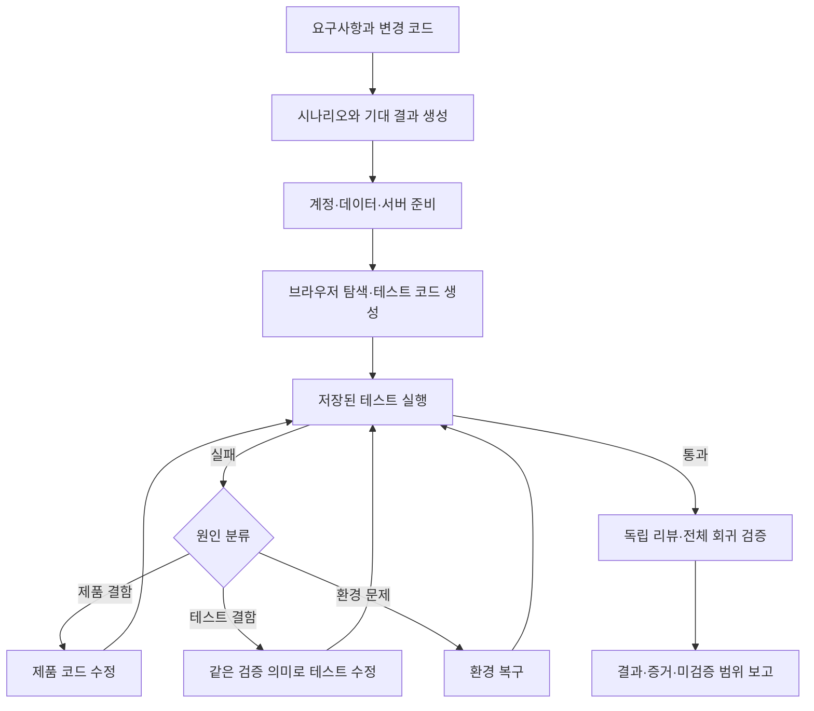
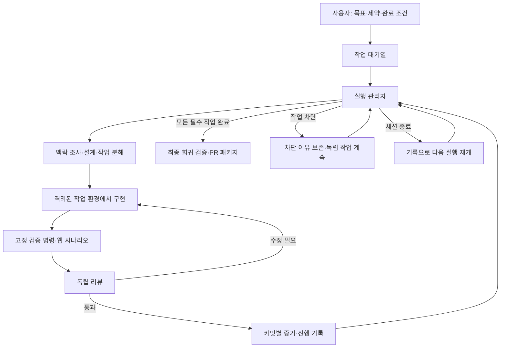

# 실제 개발팀의 AI 개발 운영 방식 조사

조사 기준일: **2026-09-17**
주요 기간: **2025년 하반기~2026년 9월**
목적: 요구사항·설계·개발·리뷰·웹 테스트를 연결하고, 사람의 중간 개입을 줄이는 개발 시스템의 근거 확보
자료: 개발팀의 공식 기술 글, 담당자의 직접 경험, 공식 저장소·문서, 생산성 연구 **36개**

## 1. 먼저 읽을 결론

**공개 사례를 종합하면, 앞서가는 팀은 AI를 오래 실행할 수 있는 개발 환경과 검증 체계를 만들고 있다. 다만 자율 실행의 범위와 사람의 개입 지점은 팀마다 다르다.**

반복적으로 확인한 구성은 다음과 같다.

1. **작업을 위임할 수 있는 입력:** 목표, 관련 코드·문서, 기대 결과를 함께 제공한다.
2. **준비된 실행 환경:** 에이전트가 앱·DB·테스트를 직접 실행할 수 있다.
3. **구현과 검증의 반복:** 코드 작성 뒤 빌드·테스트·리뷰 피드백을 받아 스스로 수정한다.
4. **관찰 가능한 결과:** diff뿐 아니라 실제 실행 결과, 화면, 로그, CI 상태를 남긴다.
5. **제한된 자율성:** 작업 범위, 재시도, 도구 권한, 병합 정책을 명시한다.
6. **환경의 지속 개선:** 반복 실수를 지침·테스트·도구·평가 사례로 바꾼다.

이 패턴은 [Stripe의 Minions](https://stripe.dev/blog/minions-stripes-one-shot-end-to-end-coding-agents-part-2), [Ramp의 Inspect](https://engineering.ramp.com/post/why-we-built-our-background-agent), [Spotify의 Honk](https://engineering.atspotify.com/2026/6/code-with-claude-coding-is-no-longer-the-constraint), [OpenAI의 특정 내부 제품 팀](https://openai.com/index/harness-engineering/)에서 서로 다른 형태로 나타난다.

**사용자님에게 권하는 방향은 ‘검증된 PR까지 자율 실행’이다.** 먼저 기능 하나를 요구 정리부터 실제 웹 시나리오 검증까지 연결한다. 이후 중단·복구와 반복 작업을 안정화하고, 독립적인 작업의 병렬화를 추가한다. 이 권고는 아래 사례를 종합한 판단이며 업계의 단일 표준은 아니다.

## 2. 조사 방법과 해석 범위

### 자료 구분

| 표시 | 의미 | 해석 범위 |
|---|---|---|
| 운영 사례 | 담당 팀이 실제 업무에 적용했다고 공개 | 해당 팀·시점·업무 범위에 한정 |
| 실험 | 특정 과제에서 한계를 확인한 연구·시범 실행 | 전체 제품·조직의 표준으로 일반화하지 않음 |
| 개인 경험 | 실제 개발자가 직접 설명한 작업 방식 | 개인에게 맞는 방식이며 조직 전체의 증거는 아님 |
| 도구·방법론 | 공식 문서·오픈소스가 제공하는 기능과 절차 | 실제 채택률이나 생산성 효과를 증명하지 않음 |
| 연구 | 조사·실험 설계와 결과를 공개 | 표본·시기·측정 방식의 제약을 함께 확인 |

공식 자료도 대부분 자기 보고다. AI가 작성한 코드·PR 비율, PR 증가율, 개발 속도, 품질, 비용 절감은 서로 다른 지표다. 통제집단이 없는 수치를 AI의 인과 효과로 해석하지 않았다. 공개가 많은 선도 조직을 중심으로 조사했기 때문에 일반적인 개발팀의 평균을 대표하지도 않는다.

본문의 ‘확인된 방식’은 출처에 근거한 요약이다. ‘적용 판단’과 후반의 제안은 이번 조사의 해석이다. 자료에 사람의 승인 여부가 없으면 ‘미공개’로 남겼다. 검색 결과의 상대 날짜보다 원문의 날짜를 우선했다. 저장소·문서는 2026-09-17 조회 상태이며 이후 바뀔 수 있다.

Stripe 글은 웹 본문 추출에서 내용이 누락되어 공식 페이지 HTML에 포함된 기사 데이터를 추가 확인했다. Ramp Inspect 소개는 공식 도메인의 검색 색인 본문으로 확인했고, 유지보수 사례는 Ramp Labs 원문으로 별도 확인했다. 공개 자료만 사용했으며 회사 내부 시스템에 접근하지 않았다.

## 3. 회사·팀별 비교

| 회사·팀 | 확인 시점 | 구분 | 실제 위임 단위 | 검증·완료 방식 | 사람의 역할 |
|---|---|---|---|---|---|
| Stripe Leverage | 2026-02 | 운영 | 하나의 개발 작업 | 로컬 검사·CI·PR | 최종 코드 리뷰, 반복 실패 인수 |
| Ramp Inspect / Sheets | 2026-01~03 | 운영 | 개발 요청·운영 오류 | 실행 환경·화면·API·재현 테스트 | Sheets 수정 병합 전 리뷰 |
| Spotify 플랫폼 팀 | 2025-11 / 2026-06 | 운영 | 마이그레이션·코드 변경 | CI·린트·PR 상태 추적 | 대상·정책 결정, 필요한 리뷰 |
| Uber 개발 생산성 | 2025-08 / 2026-08 | 운영 | 리뷰·CI 복구·PR·운영 대응 | 실제 업무 벤치마크·시각 검증 등 | 리뷰·에스컬레이션·비용 운영 |
| OpenAI 내부 제품 팀 | 2026-02 | 제한된 팀의 운영 | 기능·버그 수정 | 앱·로그·메트릭·에이전트 리뷰 | 목표·환경·결과 판단 |
| Anthropic 제품 팀·Labs | 2026-03 / 06 | 운영 + 별도 실험 | 협업 채널의 작업 / 앱 기능 | 도구 실행 / 별도 평가자 | 실제 운영의 상세 병합 정책 미공개 |
| Meta 데이터 인프라 | 2026-04 | 운영 + 예비 평가 | 코드 조사·설정 변경 | 도메인 문서·의존성·검증 | 지식과 검증 기반 정비 |
| GitHub Copilot 팀 | 2026-06~09 | 운영·제품 개선 | 리뷰·위임·도구 사용 흐름 | 실행 기록·오프라인 평가·A/B | 에이전트 동작의 측정·개선 |
| Microsoft Aspire 팀 | 2026-07 | 운영 | 제품 변경에 따른 문서 작업 | 문서 초안 PR·담당 엔지니어 확인 | 전문가 리뷰와 병합 |
| Cloudflare vinext | 2026-02 | 실험적 프로젝트 | API 호환 기능 단위 | 단위·E2E·타입·린트·AI 리뷰 | 설계·우선순위·방향 수정 |
| Cursor 연구팀 | 2026-01~07 | 연구 실험 | 계획자가 나눈 작업 | 작업별 평가·보류된 테스트 묶음 | 실험 설계와 실행 체계 개선 |

각 행의 근거와 한계는 아래 사례 설명에 연결했다. 이 표는 자율성 순위가 아니다.

## 4. 실제 운영 사례 상세

### 4.1 Stripe: 정해진 실행 흐름 안에서 에이전트를 자율적으로 움직인다

**확인된 방식.** Minions는 무인으로 개발 작업을 수행하고 사람이 코드를 리뷰하는 내부 시스템이다. 2026-02-19 글은 주당 1,300개 이상의 병합 PR이 Minions가 작성한 것이라고 보고한다. 개발자는 작업을 맡긴 뒤 다른 업무를 할 수 있다. [S01](https://stripe.dev/blog/minions-stripes-one-shot-end-to-end-coding-agents), [S02](https://stripe.dev/blog/minions-stripes-one-shot-end-to-end-coding-agents-part-2)

구조의 중심은 `Blueprint`다. 구현·오류 수정은 에이전트가 판단하고, 린트 실행·변경 push 같은 절차는 일반 코드가 수행한다. 실행 환경은 미리 준비된 devbox이고, 필요한 내부 도구만 제공한다. CI는 최대 두 차례 실행한 뒤 남은 문제를 사람에게 넘긴다. ‘one-shot’은 내부에서 한 번도 수정하지 않는다는 뜻이 아니다. [S02](https://stripe.dev/blog/minions-stripes-one-shot-end-to-end-coding-agents-part-2)

**적용 판단.** 사용자 개입을 줄이려면 필수 검증과 상태 전이는 프로그램으로 고정하고, 구현 방법은 에이전트에 맡기는 구성이 유력하다. 무제한 수정 반복을 성공 요건으로 삼을 필요는 없다.

### 4.2 Ramp: 실제 앱을 실행할 수 있어야 결과를 맡길 수 있다

**확인된 방식.** Inspect는 세션별 VM에 프론트엔드, DB, 워크플로 서비스와 관찰 도구를 제공한다. 백엔드는 테스트·텔레메트리, 프론트엔드는 화면 확인·스크린샷·미리보기로 작업을 검증한다. 설치·복제 시간을 줄이기 위해 환경을 사전 준비한다. [S03](https://engineering.ramp.com/post/why-we-built-our-background-agent)

Ramp Sheets 팀은 야간 QA를 운영했지만 에이전트가 익숙한 경로만 반복하는 한계를 발견했다. 이후 변경 코드에서 모니터를 만들고, 알림이 발생하면 오류 맥락을 넣어 샌드박스에서 재현·수정하도록 확장했다. 중복 알림에는 기존 PR 상태를 활용했고, 수정 코드는 엔지니어 리뷰 없이 병합하지 않았다. [S04](https://labs.ramp.com/research/ramp-sheets-self-maintaining/)

**적용 판단.** 웹 자동 테스트에는 실행 환경과 구체적인 시나리오가 우선이다. 운영 단계에는 오류 신호로 대상을 좁혀 재현하는 흐름을 추가하는 편이 유용하다.

### 4.3 Spotify: 기존 개발 플랫폼 안에 코드 작성 능력을 연결한다

**확인된 방식.** Honk는 기존 Fleet Management의 변경 실행 과정에 들어간다. 대상 선정·일정·상태 추적은 플랫폼이 맡고, 에이전트가 변경·빌드·테스트·PR을 수행한다. 2025년 글은 에이전트가 만든 1,500개 이상의 PR 병합을 보고했다. [S05](https://engineering.atspotify.com/2025/11/spotifys-background-coding-agent-part-1)

2026년에는 Claude Agent SDK 기반 실행을 Kubernetes에서 운영하고, Backstage의 컴포넌트 지식과 CI를 활용한다고 설명했다. 코드 패턴이 일관된 저장소에서 결과가 좋았고, 린트가 잘못된 패턴을 즉시 알려준다. 대규모 자동 유지보수 PR 수에는 기존 스크립트 자동화도 포함되므로 이를 모두 AI 성과로 계산하면 안 된다. [S06](https://engineering.atspotify.com/2026/6/code-with-claude-coding-is-no-longer-the-constraint)

**적용 판단.** 기존 CI와 프로젝트 구조를 재사용하고, 에이전트는 변경 작업을 맡는 실행자로 연결한다. 조직 표준의 일관성도 자동화 성능에 영향을 준다.

### 4.4 Uber: 개발 에이전트를 운영하고 평가하는 플랫폼을 만든다

**확인된 방식.** 2026-08-27 공개 글에는 코드 리뷰, CI 실패 복구, 시각 검증을 포함한 PR 완료, 오류 조사 등 관리형 에이전트가 등장한다. 로컬·클라우드 에이전트에 귀속된 PR이 70% 이상이라고 보고하지만, 이는 완전 무인 병합 비율이 아니다. [S08](https://www.uber.com/us/en/blog/efficient-software-factory/)

모델 선택은 실제 업무 벤치마크를 기반으로 한다. 에이전트별 완료 결과당 비용, 품질 신호, 처리량을 함께 보고 도구·컨텍스트의 불필요한 비용을 줄인다. 앞선 uReview 사례는 리뷰 코멘트의 양보다 정확도·유용성을 우선하며 낮은 가치의 지적과 중복을 줄였다. [S07](https://www.uber.com/si/en/blog/ureview/), [S08](https://www.uber.com/us/en/blog/efficient-software-factory/)

**적용 판단.** ‘항상 가장 강한 모델’이나 ‘가능한 많은 코멘트’ 대신 업무별 평가를 둔다. 성공한 기능·유효한 리뷰 한 건의 비용을 측정해야 한다.

### 4.5 OpenAI: 저장소와 개발 환경을 에이전트가 이해하고 검사할 수 있게 만든다

**확인된 방식.** 특정 내부 제품 팀은 Codex가 코드를 만들고 리뷰·수정·검증을 반복하는 방식을 공개했다. 짧은 `AGENTS.md`는 상세 문서의 진입점이고, 계획과 설계 지식은 저장소에서 관리한다. 아키텍처 제약은 린트·구조 테스트로 강제한다. [S09](https://openai.com/index/harness-engineering/)

에이전트가 작업별 앱 인스턴스, 브라우저, 로그·메트릭을 사용할 수 있으며 일부 흐름은 병합까지 수행한다. 해당 글은 사람의 PR 리뷰가 항상 필요한 구조가 아니라고 설명한다. 동시에 이런 자율성은 해당 저장소에 투자한 구조·도구에 의존한다고 명시한다. [S09](https://openai.com/index/harness-engineering/)

**적용 판단.** ‘AI가 실행하고 결과를 볼 수 있는 프로젝트’를 만드는 것이 선행 작업이다. 이 팀의 낮은 병합 장벽을 일반적인 서비스의 기본 정책으로 복제할 근거는 부족하다.

### 4.6 Anthropic: 실제 협업 흐름과 장기 실행 실험을 구분해서 봐야 한다

**확인된 운영.** 팀별 사용 사례는 하나의 통일된 프로세스보다 디버깅·프로토타입·코드 탐색 등 다양한 활용을 보여준다. 2026-06-23 Claude Tag 발표에서는 Slack에서 맥락을 가진 작업을 위임하는 것이 주요 내부 업무 방식이며 제품 팀 코드의 65%가 내부 버전에서 만들어진다고 보고했다. 코드 비율의 상세 측정법이나 모든 변경의 병합 절차는 공개하지 않았다. [S10](https://claude.com/blog/how-anthropic-teams-use-claude-code), [S11](https://www.anthropic.com/news/introducing-claude-tag)

**별도 실험.** 2025년 장기 실행 연구는 초기 환경 준비, 기능 목록, Git·진행 기록으로 세션 간 작업을 연결했다. 2026년 후속 실험은 계획·생성·평가 역할을 나누고 구현 전에 완료 조건을 정했다. 평가자는 Playwright로 UI·API·DB 상태를 검사했다. 한 비교에서는 실행 비용이 단일 에이전트보다 20배 이상 높았다. [S12](https://www.anthropic.com/engineering/effective-harnesses-for-long-running-agents), [S13](https://www.anthropic.com/engineering/harness-design-long-running-apps)

**적용 판단.** 역할 분리와 검증 계약은 참고할 가치가 높다. 모든 작업에 여러 에이전트를 투입하는 비용은 별도 평가해야 한다.

### 4.7 Meta: 기존 코드에 숨어 있는 규칙을 필요한 순간에 제공한다

**확인된 방식.** 데이터 파이프라인 팀은 컴파일은 되지만 동작이 틀리는 변경의 원인을 도메인 지식 부족에서 찾았다. 모듈 역할, 변경 패턴, 숨은 제약, 의존성을 조사해 짧은 맥락 문서와 연결 지도를 만들었다. 필요한 문서만 읽도록 하고 오래된 경로·설명을 주기적으로 갱신한다. [S14](https://engineering.fb.com/2026/04/06/developer-tools/how-meta-used-ai-to-map-tribal-knowledge-in-large-scale-data-pipelines/)

6개 작업의 예비 평가에서는 도구 호출과 토큰이 약 40% 줄었다고 보고한다. 소수의 사내 파이프라인 작업 결과이며 모든 저장소에서 문서가 많을수록 좋다는 증거는 아니다. [S14](https://engineering.fb.com/2026/04/06/developer-tools/how-meta-used-ai-to-map-tribal-knowledge-in-large-scale-data-pipelines/)

**적용 판단.** AI가 자주 틀리는 비즈니스 규칙부터 짧게 정리한다. 코드에서 쉽게 알 수 있는 설명을 대량 생성하는 것보다 변경 금지 이유·숨은 의존성을 남기는 편이 중요하다.

### 4.8 GitHub: 에이전트의 실행 기록으로 작업 방식을 개선한다

**확인된 방식.** 코드 리뷰 팀은 도구 교체 뒤 비용이 증가하고 결함 탐지가 나빠지는 회귀를 겪었다. diff에서 질문을 만들고 필요한 코드만 찾도록 지침을 바꾼 뒤, 품질을 유지하면서 평균 리뷰 비용을 약 20% 낮췄다고 보고했다. 개발 에이전트와 리뷰 에이전트에 같은 탐색 지침을 적용하는 것이 효과적이지 않았다. [S15](https://github.blog/ai-and-ml/github-copilot/better-tools-made-copilot-code-review-worse-heres-how-we-actually-improved-it/)

CLI 팀은 불필요한 하위 에이전트 호출, 중복 탐색, 순차 대기 등을 실행 기록으로 발견했다. 작은 변경은 직접 처리하고 독립적인 일에 선택적으로 위임하도록 수정한 뒤 오프라인 평가와 운영 A/B로 확인했다. [S16](https://github.blog/ai-and-ml/how-we-made-github-copilot-cli-more-selective-about-delegation/)

9월 글은 출력 압축도 전체 작업 기준으로 평가해야 한다고 설명한다. `git diff`를 너무 줄이면 원본을 다시 읽어 비용이 증가했기 때문이다. [S35](https://github.blog/ai-and-ml/github-copilot/how-we-make-ai-coding-more-cost-efficient-without-sacrificing-task-quality/)

**적용 판단.** 에이전트 수와 토큰 수보다 완료까지의 실행 경로를 측정한다. 리뷰에는 결함 근거를 찾는 전용 지침이 필요하다.

### 4.9 Microsoft Aspire: 제품 변경을 후속 문서 작업의 트리거로 쓴다

**확인된 방식.** Aspire 팀은 제품 PR 병합 후 문서가 필요한 변경인지 판단하고 별도 문서 저장소에 초안 PR을 만든다. 해당 기능을 구현한 엔지니어가 리뷰하며 에이전트는 병합하지 않는다. 모델은 원하는 변경을 구조화된 결과로 내고, 제한된 권한의 별도 작업이 GitHub에 반영한다. [S17](https://github.blog/ai-and-ml/github-copilot/automating-cross-repo-documentation-with-github-agentic-workflows/)

2026-05-03~06-02 집계는 제품 PR 396개에 대한 실행, 문서 PR 82개 생성·병합을 보고한다. 초기에 내부 변경까지 문서화하는 문제가 있어 제외 사례를 추가했다. 보고된 문서 PR 병합 시간 중앙값은 44.8시간이다. [S17](https://github.blog/ai-and-ml/github-copilot/automating-cross-repo-documentation-with-github-agentic-workflows/)

**적용 판단.** 개발 이후의 문서화도 이벤트로 연결할 수 있다. ‘아무 작업도 만들지 않음’이 올바른 결과인 상황을 명세해야 불필요한 PR을 줄일 수 있다.

### 4.10 Cloudflare: 명확한 호환 목표와 테스트를 중심으로 구현을 반복한다

**확인된 방식.** vinext 개발자는 먼저 아키텍처와 구현 순서를 정하고, 기능별 구현·테스트·수정을 반복했다. PR의 AI 리뷰와 리뷰 지적 수정도 상당 부분 자동화했다. 공개 시점에 1,700개 이상의 Vitest 테스트, 380개 Playwright E2E, 타입 검사·린트를 CI에서 실행한다고 설명했다. [S18](https://blog.cloudflare.com/vinext/)

AI가 실제 Next.js 동작과 다른 구현을 내놓아 사람이 방향을 수정한 경우도 공개했다. 당시 프로젝트는 experimental이며 충분한 운영 트래픽에서 검증되지 않았다고 명시했다. ‘일주일 만에 완성된 대체 프레임워크’로 단정하면 이 제한을 놓친다. [S18](https://blog.cloudflare.com/vinext/)

**적용 판단.** 외부 동작 계약과 비교할 테스트가 명확한 작업은 자동 반복에 적합하다. 테스트 수나 CI 통과를 운영 성숙도의 대체 지표로 쓰지 않는다.

### 4.11 Cursor: 대규모 병렬 작업은 가능하지만 조정 비용이 크다

**확인된 실험.** 초기에는 동등한 에이전트들이 공용 상태를 읽고 작업을 가져가게 했지만 잠금·대기·책임 회피 문제가 발생했다. 계획과 작업 수행의 역할을 분리하고 반복 단위로 평가하는 구조를 실험했다. [S19](https://cursor.com/blog/scaling-agents)

7월 후속 글은 초기 브라우저 프로젝트가 개념 증명에는 성공했지만 완성도 높은 소프트웨어에는 미치지 못했다고 설명한다. 이후 계획자와 작업자의 맥락을 분리하고 모델 조합·비용을 비교했으며, SQLite 재구현에서 외부에 보류된 테스트 묶음으로 평가했다. [S20](https://cursor.com/blog/agent-swarm-model-economics)

**적용 판단.** 여러 에이전트의 가치는 병렬 처리뿐 아니라 각 작업의 맥락을 좁히는 데 있다. 대규모 군집은 성숙한 제품 개발의 기본값으로 보기 어렵다.

## 5. 오픈소스 개발자는 어떻게 일하는가

### Mitchell Hashimoto: 자신이 집중하는 동안 명확한 작업을 배경에서 진행

2026-02-05 직접 경험 글에서는 명확한 작업 분리, 모호한 작업의 계획·실행 분리, 자동 검증 도구를 강조한다. 퇴근 전 조사·이슈 분류를 맡겨 다음 날 시작을 돕고, 익숙한 작업을 백그라운드에 위임한다. 당시에는 여러 구현 에이전트를 동시에 운영하지 않았고, 실제 배경 실행 시간도 업무일의 일부였다. ‘항상 실행’은 목표이며 실적과 구분했다. [S21](https://mitchellh.com/writing/my-ai-adoption-journey)

**적용 판단.** 사람의 시간을 보존하려면 알림·검토 시점까지 설계해야 한다. 처음에는 신뢰할 수 있는 한 작업부터 위임해도 된다.

### Simon Willison: 실행해 보고, 발견한 문제를 재현 테스트로 남긴다

라이브러리는 실제 함수 호출, API는 서버와 HTTP 요청, 웹 UI는 브라우저 자동화로 탐색한다. 자동 테스트가 놓친 문제를 찾으면 실패하는 테스트부터 남겨 수정하고 회귀를 막는다. 화면 확인과 실제 사용자 동작은 자동 테스트를 보완한다. [S22](https://simonwillison.net/guides/agentic-engineering-patterns/agentic-manual-testing/)

**적용 판단.** 에이전트가 스스로 결과를 관찰할 도구가 필요하다. 탐색 중 발견한 결함은 반복 실행 가능한 테스트로 축적한다.

두 사례는 숙련 개발자의 직접 경험이다. 오픈소스 전체가 같은 방식으로 일한다고 말할 근거는 아니다.

## 6. 최근 자료가 보여주는 변화

아래는 조사 자료의 흐름을 정리한 것으로, 업계 전체의 보급률을 뜻하지 않는다.

| 시기 | 관찰되는 강조점 | 대표 자료 |
|---|---|---|
| 2025년 하반기 | 코드 리뷰 보조, 대규모 마이그레이션, 세션 인수인계 | [Uber uReview](https://www.uber.com/si/en/blog/ureview/), [Spotify](https://engineering.atspotify.com/2025/11/spotifys-background-coding-agent-part-1), [Anthropic 장기 실행](https://www.anthropic.com/engineering/effective-harnesses-for-long-running-agents) |
| 2026년 1~3월 | 원격 실행 환경, 무인 작업, 실제 앱 검증, 구현·평가 분리 | [Ramp](https://engineering.ramp.com/post/why-we-built-our-background-agent), [Stripe](https://stripe.dev/blog/minions-stripes-one-shot-end-to-end-coding-agents-part-2), [Anthropic 실험](https://www.anthropic.com/engineering/harness-design-long-running-apps) |
| 2026년 4~7월 | 도메인 지식, 선택적 위임, 리뷰 효율, 문서까지 연결 | [Meta](https://engineering.fb.com/2026/04/06/developer-tools/how-meta-used-ai-to-map-tribal-knowledge-in-large-scale-data-pipelines/), [GitHub](https://github.blog/ai-and-ml/how-we-made-github-copilot-cli-more-selective-about-delegation/), [Aspire](https://github.blog/ai-and-ml/github-copilot/automating-cross-repo-documentation-with-github-agentic-workflows/) |
| 2026년 8~9월 | 전체 개발 과정의 재설계, 결과당 비용, 에이전트 행동 평가 | [Anthropic 플레이북](https://claude.com/blog/the-ai-native-sdlc-playbook), [Uber](https://www.uber.com/us/en/blog/efficient-software-factory/), [Google](https://developers.googleblog.com/the-anatomy-of-harness-engineering-how-to-evaluate-iterate-and-guard-ai-coding-agents/) |

## 7. 요구사항부터 운영까지 연결하는 방법

다음 표는 여러 사례를 종합한 적용안이다. 모든 팀이 이 전체 흐름을 운영한다는 뜻은 아니다.

| 단계 | 자동화할 일 | 사람이 판단할 일 | 완료 증거 |
|---|---|---|---|
| 요구 정리 | 이슈·문서·코드에서 맥락 수집, 수용 기준 초안 | 목표·제품 정책의 중요한 모호함 | 범위와 기대 동작 |
| 설계 | 기존 구조 조사, 대안 비교, 변경 영향과 작업 분해 | 비가역적 선택·큰 범위 변경 | 설계·결정 이유·검증 계획 |
| 개발 | 독립 작업 구현, 관련 테스트 작성·실행 | 위임 범위 밖의 결정 | 변경 커밋과 실행 결과 |
| 리뷰 | 명세 누락·결함 검사, 지적의 재현·수정 | 제품 판단·중요한 예외 | 근거 있는 리뷰와 해결 상태 |
| 웹 검증 | 시나리오 생성, 계정·데이터 준비, 브라우저 실행 | 정책이 불명확한 기대 결과 | 시나리오별 결과와 trace |
| 전달 | PR·문서·실행 예시 작성 | 프로젝트 정책에 따른 병합·배포 | 최종 검증 버전과 결과 패키지 |
| 유지보수 | 오류 분류·재현, 수정 PR, 문서 갱신 | 영향·우선순위·예외 | 중복 없는 이슈와 회귀 테스트 |

이 연결 방식의 문서화된 참고 자료는 Anthropic의 AI-Native SDLC 플레이북이다. 단계마다 버전 관리되는 산출물을 남기고, 다음 단계가 이를 읽는 흐름을 설명한다. 이는 적용 가이드이며 회사 전반의 실제 실행률을 보여주는 자료는 아니다. [S23](https://claude.com/blog/the-ai-native-sdlc-playbook)

## 8. 웹 테스트 자동화에서 실제로 배울 점

### 확인된 실무와 도구 기능

| 관찰 | 근거 | 우리 시스템에 주는 의미 |
|---|---|---|
| 실행 환경이 있어야 UI·API 문제를 재현할 수 있음 | [Ramp Inspect](https://engineering.ramp.com/post/why-we-built-our-background-agent) | 계정·데이터·서버 준비를 자동화 범위에 포함 |
| 막연한 전체 QA는 익숙한 경로를 반복할 수 있음 | [Ramp Sheets](https://labs.ramp.com/research/ramp-sheets-self-maintaining/) | 변경·요구·오류 신호에서 구체적인 시나리오 생성 |
| E2E와 타입·단위 테스트를 함께 사용 | [Cloudflare](https://blog.cloudflare.com/vinext/) | 브라우저 테스트 하나로 모든 검증을 대체하지 않음 |
| 사용 중 발견한 문제를 자동 회귀 테스트로 전환 | [Simon Willison](https://simonwillison.net/guides/agentic-engineering-patterns/agentic-manual-testing/) | 탐색 결과가 일회성 보고로 끝나지 않게 함 |
| 시나리오 계획·테스트 생성·실패 복구 역할을 제공 | [Playwright Test Agents](https://playwright.dev/docs/test-agents) | 테스트 자동화 구현의 시작점으로 활용 |

### 제안하는 테스트 흐름

**설계 제안.** 최초에는 AI가 명세와 앱을 분석해 테스트를 만들고, 반복 실행은 저장된 코드가 담당한다. 변경이 생기거나 실패 원인을 판단해야 할 때 AI를 다시 호출한다. 매번 전체 사이트를 자유 탐색하게 하는 방식보다 비용과 결과를 관리하기 쉽도록 하는 목적이다.

Playwright는 사용자에게 보이는 동작, 독립적인 테스트, 안정적인 locator, 자동 대기와 trace 사용을 권한다. 공식 healer는 깨진 기능을 판단한 뒤 테스트를 skip할 수도 있으므로, 필수 시나리오의 skip을 완료로 인정하지 않는 정책은 별도로 필요하다. [S29](https://playwright.dev/docs/test-agents), [S30](https://playwright.dev/docs/best-practices)

### 최소 완료 조건 제안

- 수용 기준마다 실행 테스트 또는 명시적인 검증 근거가 연결되어 있다.
- 정상 흐름뿐 아니라 주요 입력 오류·권한·저장 지속성·실패 복구를 확인한다.
- 테스트 계정과 데이터가 반복 실행·병렬 실행에서 충돌하지 않는다.
- 검증한 코드·테스트·환경 버전을 기록한다.
- 실패·미실행·skip·flaky를 일반 통과와 구분한다.
- 제품 결함을 기대값 완화나 테스트 삭제로 숨기지 않는다.
- 운영 서비스·실제 결제·실제 고객 발송은 사전 합의한 테스트 환경과 분리한다.

버그가 없음을 증명하거나 가능한 모든 사용자 행동을 열거하는 것은 목표로 삼지 않는다. 명세에 대한 검증 범위와 남은 불확실성을 알 수 있게 만든다. 상세 운영안은 [웹 테스트 설계안](WEB-TESTING.md)에 있다.

## 9. 바로 참고할 오픈소스와 방법론

다음은 운영 사례와 구분한 구현 후보들이다. 서로 다른 계층을 다루므로 하나를 설치한다고 전체 시스템이 완성되는 것은 아니다.

| 후보 | 해결하는 문제 | 공개된 구성 | 적용 판단 |
|---|---|---|---|
| [Spec Kit — S24](https://github.com/github/spec-kit) | 요구·계획·구현의 정합성 | 원칙, 명세, 계획, 작업, 구현, converge | 새 기능을 명세와 연결하는 기본 틀 |
| [OpenSpec — S25](https://github.com/Fission-AI/OpenSpec/blob/main/docs/getting-started.md) | 변경 단위의 명세 관리 | 탐색, 제안, 적용, 동기화, 보관 | 기존 서비스의 변경 이력에 적합 |
| [Superpowers — S26](https://github.com/obra/superpowers) | 에이전트의 개발 절차 | 요구 탐색, 계획, TDD, 작업별 리뷰, 완료 검증 | 구현 습관을 정형화하는 참고 |
| [BMAD — S27](https://github.com/bmad-code-org/BMAD-METHOD/blob/main/docs/reference/workflow-map.md) | 기획부터 구현까지의 산출물 | PRD, 설계, 작업 분해, 구현·리뷰·회고 | 복잡한 제품 기획에 적합, 작은 변경에는 간소화 |
| [Symphony — S28](https://github.com/openai/symphony) | 작업 대기열과 자율 실행 연결 | 이슈 감시, 작업별 공간, 에이전트 실행, 결과 증거 | 앞서 제안한 실행 관리자와 직접 관련 |
| [Playwright Test Agents — S29](https://playwright.dev/docs/test-agents) | 웹 시나리오·실행 테스트 생성과 복구 | Planner, Generator, Healer | 브라우저 검증 계층의 시작점 |

### 이번 추가 조사에서 특히 중요한 후보: Symphony

Symphony는 업무 추적기의 작업을 격리된 실행으로 연결하는 프로젝트다. README는 신뢰된 환경에서 시험하는 engineering preview라고 명시한다. 성숙한 범용 운영 플랫폼이라고 가정해서는 안 된다. [S28](https://github.com/openai/symphony)

명세에는 `WORKFLOW.md`로 프롬프트와 실행 설정을 버전 관리하고, 이슈별 작업 공간, 제한된 동시 실행, 재시도·상태 조정, 실행 관찰을 구현하는 구조가 있다. 업무별 PR 처리나 강한 샌드박스 전체를 자동 제공하는 계약은 아니다. [S36](https://github.com/openai/symphony/blob/main/SPEC.md)

**적용 판단.** 자체 실행 관리자를 처음부터 만들기 전에 Symphony 명세·참조 구현을 평가할 가치가 높다. 그 위에 프로젝트 명세, 검증 명령, 웹 시나리오 정책을 연결할 수 있는지 작은 기능으로 확인한다. 기존 대화의 설계 방향과 맞지만, 도입 결정은 아직 하지 않았다.

### 조합 권고

기획·명세 도구는 하나를 선택하고, 실행 관리자와 테스트 계층을 별도로 연결하는 것이 초기 구조로 적절하다. Spec Kit·OpenSpec·BMAD·Superpowers를 모두 켜면 중복된 계획·승인·작업 기록이 생길 수 있다. 이 평가는 제품 간 공식 호환성 검증 결과가 아니라 역할이 겹치는 것을 바탕으로 한 설계 판단이다.

## 10. 성공 사례만 보고 놓치기 쉬운 점

### 10.1 중간 개입을 줄이는 것과 무제한 실행은 다르다

Stripe는 CI 반복을 제한하고, Mitchell은 짧고 명확한 일을 배경에서 처리한다. 이들 사례의 가치는 사람이 매 단계 지시하지 않아도 유효한 결과를 얻는 데 있다. 장시간 실행 자체를 성과로 측정할 이유는 없다. [S02](https://stripe.dev/blog/minions-stripes-one-shot-end-to-end-coding-agents-part-2), [S21](https://mitchellh.com/writing/my-ai-adoption-journey)

### 10.2 AI 작성률·PR 개수와 생산성은 다른 지표다

생산성을 보려면 리뷰·수정·대기·회귀 대응까지 포함한 완료 시간과 비용이 필요하다. Uber는 관리형 에이전트를 결과당 비용과 품질 신호로 측정한다. [S08](https://www.uber.com/us/en/blog/efficient-software-factory/)

METR는 2026-02 후속 실험에서 AI 없이 작업하기를 꺼리는 참여자의 선택 효과, 보상 변화, 여러 에이전트 병행 시 시간 측정 문제 때문에 현재 생산성 효과를 신뢰성 있게 추정하기 어렵다고 밝혔다. 2025년의 느려짐을 최신 도구에 그대로 적용하거나, 후속 자료를 확정적인 가속 수치로 읽으면 안 된다. [S32](https://metr.org/blog/2026-02-24-uplift-update/)

DORA 2025 보고서의 공개 요약도 AI 효과를 조직의 기존 강점·약점을 증폭하는 것으로 설명한다. 모델 도입과 함께 개발 시스템을 개선해야 한다는 방향을 뒷받침하지만, 특정 자동화 구조의 인과 효과를 증명하지는 않는다. [S33](https://dora.dev/research/2025/dora-report/)

### 10.3 자동 검증만으로 사용자 경험을 완전히 판단할 수 없다

GitHub 접근성 팀은 사용자 피드백을 구조화·분류·추적하는 자동화와 사람의 검토를 연결했다. 이슈가 만들어지면 AI 분석과 프로젝트 등록이 실행되고 후속 처리로 이어진다. 사용자 경험의 문제가 검사기에 전부 잡힌다고 가정하지 않는다. [S34](https://github.blog/ai-and-ml/github-copilot/continuous-ai-for-accessibility-how-github-transforms-feedback-into-inclusion/)

**적용 판단.** 테스트 결과와 사용자 피드백은 상호 보완적이다. 화면이 뜨거나 자동 검사에 통과한 것과 실제 사용자가 목적을 달성하는 것을 구분해야 한다.

### 10.4 모델·도구·프롬프트 변경도 회귀를 만든다

Google의 2026-09-09 글은 최종 문제 해결률 외에 ‘필요한 검증을 실행했는가’ 같은 관찰 가능한 행동을 평가하자고 제안한다. 작은 행동 평가와 큰 E2E 평가를 함께 사용하되, 비결정적인 단일 실행 결과만으로 과도하게 배포를 막지 않도록 설명한다. 이는 개발팀의 전체 운영 사례보다 실행 체계 평가에 관한 공식 가이드다. [S31](https://developers.googleblog.com/the-anatomy-of-harness-engineering-how-to-evaluate-iterate-and-guard-ai-coding-agents/)

**적용 판단.** 모델을 교체할 때 기능 구현, 실패 복구, 테스트 누락, 권한 부족 같은 대표 작업을 다시 실행해 시스템 전체가 나빠지지 않았는지 확인한다.

## 11. 사용자님의 솔루션에 반영할 설계

이 절은 조사에 근거한 제안이다. 아직 실행 프로그램, 에이전트 연결, 실제 웹 테스트를 구현하거나 가동하지 않았다.

### 권장 구조

### 우선 만들 기능

| 우선순위 | 기능 | 채택 이유 | 완료 확인 방법 |
|---|---|---|---|
| 1 | 재현 가능한 개발·테스트 환경 | 에이전트가 결과를 관찰할 기반 | 한 명령으로 앱·데이터 준비 |
| 2 | 수용 기준과 작업 목록 | 자의적인 조기 완료 방지 | 기준마다 작업·검증 연결 |
| 3 | 고정 검증과 독립 리뷰 | 자기평가에만 의존하지 않음 | 잘못된 변경을 실제로 차단 |
| 4 | 웹 시나리오 생성·실행 | 사용자 여정까지 자동 확인 | 정상·오류·권한 시나리오 수행 |
| 5 | 상태 저장·재시도·재개 | 중단 때 사람이 인수인계하지 않게 함 | 세션 강제 종료 후 복구 |
| 6 | 결과·비용·차단 원인 기록 | 무인 실행의 품질·비용 관리 | 작업별 리포트와 종료 상태 |
| 7 | 독립 작업 병렬화 | 검증된 흐름의 처리량 확장 | 충돌 없이 통합·회귀 통과 |
| 8 | 운영 신호로 수정 작업 시작 | 개발 이후 유지보수까지 연결 | 오류 재현 후 수정 PR 생성 |

### 사람을 찾는 기준

기존 위임 범위 안의 구현 선택, 환경 복구, 테스트 실패, 일반 리뷰 지적은 에이전트가 처리한다. 제품 정책의 모호함, 범위를 바꾸는 선택, 기존 권한을 넘는 액션, 해결되지 않은 차단·예산 소진은 구체적인 선택지와 함께 보고한다. 한 작업이 막혀도 독립 작업은 계속한다.

### 초기 운영 시나리오

‘프로필 수정 기능’ 같은 작고 실제적인 기능 하나를 고른다. 시스템이 기존 코드 조사 → 명세·시나리오 작성 → 구현 → 브라우저 검증 → 수정 → PR 패키지까지 수행하게 한다. 제품 버그, 테스트 locator 오류, 서버 중단, 세션 종료를 각각 주입해 잘못된 성공 보고 없이 복구하는지 확인한다.

이 실험의 합격 기준은 사용자 개입 없이 통과한 테스트의 수가 아니라, 요구사항을 만족하는 결과와 신뢰 가능한 증거를 남기는 것이다. 미검증 상태를 정확히 보고하는 것도 필수다.

### 측정할 지표

| 지표 | 확인할 질문 |
|---|---|
| 기능당 사람의 개입 횟수 | 단계별 지시가 실제로 줄었는가? |
| 검증된 결과까지의 시간 | 리뷰·수정·대기까지 포함해 빨라졌는가? |
| 결과당 비용 | 실패·재시도 비용도 포함해 감당 가능한가? |
| 첫 리뷰의 차단 결함 비율 | 생성 품질이 유지·개선되는가? |
| 병합 후 회귀·되돌림 | 테스트 통과가 실제 품질로 이어지는가? |
| 중단 후 복구 성공률 | 사용자가 작업 맥락을 다시 설명하지 않아도 되는가? |
| 필수 시나리오 실행률·flaky | 검사 누락이나 우연한 통과를 숨기지 않는가? |

## 12. 앞서 만든 설계안에서 보완할 점

1. **실행 관리자를 새로 작성하기 전에 Symphony를 평가한다.** 이슈 기반 실행·상태 조정·작업 공간이라는 핵심 구조가 이미 공개되어 있다.
2. **구현자·리뷰어를 항상 모두 실행하지 않는다.** 작업 위험과 독립성에 맞춰 호출하되 필수 검증은 유지한다.
3. **웹 테스트를 생성·반복 실행·탐색으로 나눈다.** AI가 필요한 단계와 테스트 코드가 담당할 단계를 구분한다.
4. **야간 전체 QA만으로 운영 결함 탐지를 해결하려 하지 않는다.** 변경 코드와 오류 신호를 입력으로 사용하는 경로를 준비한다.
5. **무한 수정 루프를 피한다.** 무진전·비용·시간·필수 검증 실패의 종료 정책을 구현한다.
6. **모델·프롬프트·도구 변경을 평가한다.** 대표 작업의 결과와 행동을 비교할 작은 평가 묶음을 유지한다.

관련 산출물: [현행 제품 설계](../design/PRODUCT-DESIGN.md), [웹 테스트 자동화 설계](WEB-TESTING.md).

## 13. 출처 목록

모든 링크의 조회 기준일은 2026-09-17이다. 표의 날짜는 게시일 또는 문서 조회 상태를 뜻한다. 원문이 최신 상태로 갱신될 수 있으므로 숫자는 본문에 적힌 시점의 보고치로 읽어야 한다.

| ID | 날짜 | 자료·링크 | 분류 |
|---|---|---|---|
| S01 | 2026-02-09 | [Stripe — Minions Part 1](https://stripe.dev/blog/minions-stripes-one-shot-end-to-end-coding-agents) | 운영 |
| S02 | 2026-02-19 | [Stripe — Minions Part 2](https://stripe.dev/blog/minions-stripes-one-shot-end-to-end-coding-agents-part-2) | 운영·구조 |
| S03 | 2026-01-12 | [Ramp — Why We Built Our Own Background Agent](https://engineering.ramp.com/post/why-we-built-our-background-agent) | 운영 |
| S04 | 2026-03-23 | [Ramp — How we made Ramp Sheets self-maintaining](https://labs.ramp.com/research/ramp-sheets-self-maintaining/) | 운영 |
| S05 | 2025-11-06 | [Spotify — Honk Part 1](https://engineering.atspotify.com/2025/11/spotifys-background-coding-agent-part-1) | 운영 |
| S06 | 2026-06-03 | [Spotify — Coding Is No Longer the Constraint](https://engineering.atspotify.com/2026/6/code-with-claude-coding-is-no-longer-the-constraint) | 운영 |
| S07 | 2025-08-12 | [Uber — uReview](https://www.uber.com/si/en/blog/ureview/) | 운영 |
| S08 | 2026-08-27 | [Uber — Running a Software Factory Efficiently](https://www.uber.com/us/en/blog/efficient-software-factory/) | 운영 |
| S09 | 2026-02-11 | [OpenAI — Harness engineering](https://openai.com/index/harness-engineering/) | 제한된 팀의 운영 |
| S10 | 2025년 공개 사례 | [Anthropic — How Anthropic teams use Claude Code](https://claude.com/blog/how-anthropic-teams-use-claude-code) | 팀별 활용 |
| S11 | 2026-06-23 | [Anthropic — Introducing Claude Tag](https://www.anthropic.com/news/introducing-claude-tag) | 내부 활용을 포함한 제품 발표 |
| S12 | 2025-11-26 | [Anthropic — Effective harnesses for long-running agents](https://www.anthropic.com/engineering/effective-harnesses-for-long-running-agents) | 실험 |
| S13 | 2026-03-24 | [Anthropic — Harness design for long-running application development](https://www.anthropic.com/engineering/harness-design-long-running-apps) | 실험 |
| S14 | 2026-04-06 | [Meta — Mapping tribal knowledge](https://engineering.fb.com/2026/04/06/developer-tools/how-meta-used-ai-to-map-tribal-knowledge-in-large-scale-data-pipelines/) | 운영·예비 평가 |
| S15 | 2026-07-10 | [GitHub — Better tools made Copilot code review worse](https://github.blog/ai-and-ml/github-copilot/better-tools-made-copilot-code-review-worse-heres-how-we-actually-improved-it/) | 제품팀의 개선 사례 |
| S16 | 2026-06-12 | [GitHub — More selective delegation](https://github.blog/ai-and-ml/how-we-made-github-copilot-cli-more-selective-about-delegation/) | 제품팀의 개선 사례 |
| S17 | 2026-07-08 | [Microsoft Aspire — Cross-repo documentation](https://github.blog/ai-and-ml/github-copilot/automating-cross-repo-documentation-with-github-agentic-workflows/) | 운영 |
| S18 | 2026-02-24 | [Cloudflare — How we rebuilt Next.js with AI](https://blog.cloudflare.com/vinext/) | 실험적 프로젝트 |
| S19 | 2026-01-14 | [Cursor — Scaling long-running autonomous coding](https://cursor.com/blog/scaling-agents) | 실험 |
| S20 | 2026-07-20 | [Cursor — Agent swarms and the new model economics](https://cursor.com/blog/agent-swarm-model-economics) | 후속 실험 |
| S21 | 2026-02-05 | [Mitchell Hashimoto — My AI Adoption Journey](https://mitchellh.com/writing/my-ai-adoption-journey) | 개인 경험 |
| S22 | 2026년 공개 가이드 | [Simon Willison — Agentic manual testing](https://simonwillison.net/guides/agentic-engineering-patterns/agentic-manual-testing/) | 개인 경험·방법론 |
| S23 | 2026-08-21 | [Anthropic — AI-Native SDLC playbook](https://claude.com/blog/the-ai-native-sdlc-playbook) | 적용 가이드 |
| S24 | 조회일 기준 | [GitHub Spec Kit](https://github.com/github/spec-kit) | 오픈소스 |
| S25 | 조회일 기준 | [OpenSpec Getting Started](https://github.com/Fission-AI/OpenSpec/blob/main/docs/getting-started.md) | 오픈소스 |
| S26 | 조회일 기준 | [Superpowers](https://github.com/obra/superpowers) | 오픈소스 |
| S27 | 조회일 기준 | [BMAD Workflow Map](https://github.com/bmad-code-org/BMAD-METHOD/blob/main/docs/reference/workflow-map.md) | 오픈소스 |
| S28 | 조회일 기준 | [OpenAI Symphony README](https://github.com/openai/symphony) | engineering preview |
| S29 | 조회일 기준 | [Playwright Test Agents](https://playwright.dev/docs/test-agents) | 공식 도구 문서 |
| S30 | 조회일 기준 | [Playwright Best Practices](https://playwright.dev/docs/best-practices) | 공식 도구 문서 |
| S31 | 2026-09-09 | [Google — The Anatomy of Harness Engineering](https://developers.googleblog.com/the-anatomy-of-harness-engineering-how-to-evaluate-iterate-and-guard-ai-coding-agents/) | 평가 가이드 |
| S32 | 2026-02-24 | [METR — Developer Productivity Experiment Design](https://metr.org/blog/2026-02-24-uplift-update/) | 연구·측정 한계 |
| S33 | 2025년판 | [DORA — State of AI-assisted Software Development](https://dora.dev/research/2025/dora-report/) | 연구 공개 요약 |
| S34 | 2026-03-12 | [GitHub — Continuous AI for accessibility](https://github.blog/ai-and-ml/github-copilot/continuous-ai-for-accessibility-how-github-transforms-feedback-into-inclusion/) | 운영 |
| S35 | 2026-09-02 | [GitHub — Cost-efficient AI coding](https://github.blog/ai-and-ml/github-copilot/how-we-make-ai-coding-more-cost-efficient-without-sacrificing-task-quality/) | 제품팀의 개선 사례 |
| S36 | 조회일 기준 | [OpenAI Symphony SPEC](https://github.com/openai/symphony/blob/main/SPEC.md) | 실행기 명세 |
